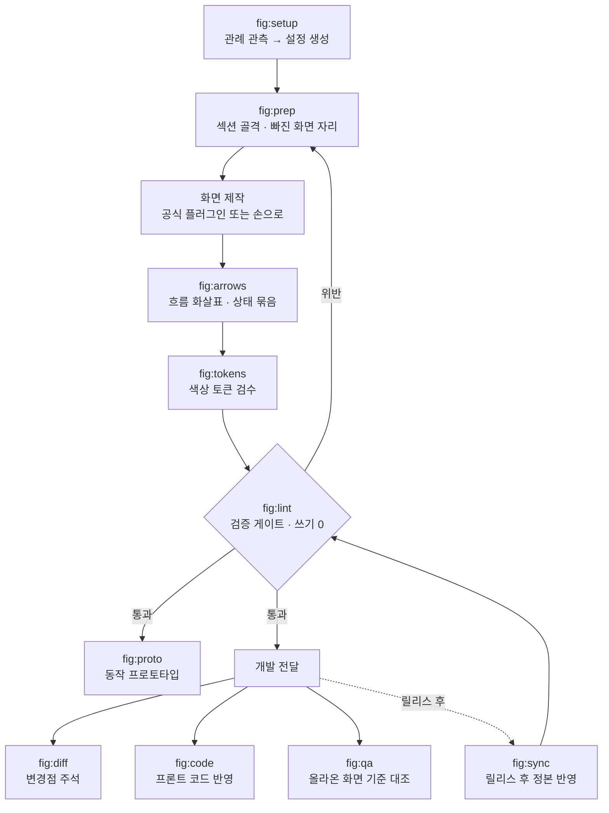

# fig · pm

**한국어** · [English](README.md)

Claude Code 플러그인은 대개 코드를 향해 있습니다. 이 둘은 그 옆의 일을 향합니다. 화면을 그리는 Figma 파일과, 그 옆에 쓰는 기획 문서. 한 저장소에 있고 설치는 따로 갑니다.

| 플러그인 | 무엇을 |
|---|---|
| **fig** | 화면 그리는 일의 앞뒤 전부 — 그릴 목록 만들기, 검증, 정본 동기화 |
| **pm** | 기획 문서를 쓰고 검증하고, 거기서 나온 일감을 잡아 등록·정합 |

**쓰는 데 코드를 짤 일은 없습니다.** 평소 Claude에게 말하듯 `/fig:lint`라고 치면 말로 답이 옵니다. 중간에 실행할 명령이나 고칠 설정 파일이 나오는데, 직접 치는 대신 Claude에게 시키면 됩니다. 대신 해 주고 무엇을 봤는지 알려 줍니다.

<sub>**Claude Code가 처음이라면** — 터미널·데스크톱 앱·에디터에서 도는 Anthropic의 어시스턴트입니다. [claude.com/claude-code](https://claude.com/claude-code)에서 먼저 설치하세요. 여기서 말하는 *플러그인*은 거기에 명령을 더하는 것이고, *마켓플레이스*는 그 명령을 받아 오는 곳입니다.</sub>

둘은 서로를 필요로 하지 않습니다. 아래는 대부분 `fig` 이야기이고, `pm`은 [따로 정리해 뒀습니다](#pm--기획-문서). 둘 다 쓸 때 맞춰야 할 설정 두 개는 [둘이 만나는 지점](#둘이-만나는-지점)에 있습니다.

[무엇을 해결하나](#무엇을-해결하나) · [누가 쓰면 좋은가](#누가-쓰면-좋은가) · [시작하기](#시작하기) · [**fig**](#fig--그리는-파일) · [**pm**](#pm--기획-문서) · [둘이 만나는 지점](#둘이-만나는-지점) · [설정](#설정) · [막혔을 때](#막혔을-때) · [어떤 자리에 서는 도구인가](#어떤-자리에-서는-도구인가) · [설계 원칙](#설계-원칙)

<details>
<summary>낯선 말이 있다면 — 열 개, 한 줄씩</summary>

| 말 | 여기서는 |
|---|---|
| **Claude Code** | 터미널·데스크톱 앱·에디터에서 도는 Anthropic 어시스턴트. 아래 이야기는 전부 그 안에서 벌어집니다 |
| **플러그인** | Claude Code에 명령을 더하는 꾸러미. 여기서는 `fig`와 `pm` 둘입니다 |
| **마켓플레이스** | 플러그인을 받아 오는 곳. 이 저장소 것은 `byjunyoung`입니다 |
| **스킬 · 슬래시 명령** | `/fig:lint`처럼 치는 명령 하나. 그걸 쳤을 때 Claude가 따르는 지시서가 스킬입니다 |
| **설정 파일** | 팀 규칙을 담은 텍스트 파일 하나 — 화면 이름을 어떻게 짓는지, 얼마나 띄우는지. 첫 벌은 `/fig:setup`이 씁니다 |
| **`null`** | 일부러 비워 둔 설정. 그 값이 필요한 검사는 넘겨짚지 않고 건너뜁니다 |
| **토큰** | 각 도구에서 직접 발급하는 열쇠. 스킬이 그 도구와 바로 이야기할 수 있게 해 줍니다. Figma·GitHub 각각 있습니다 |
| **연결(커넥터)** | Claude에 붙여 둔 도구 — Notion, Slack, GitHub. 붙어 있는 것만 스킬이 닿습니다 |
| **트래커** | 개발이 티켓을 관리하는 곳 — GitHub, Jira, Linear. `pm`이 여기로 등록합니다 |
| **정본 페이지** | 지금 기준이 되는 Figma 페이지. 옆에 두는 작업본과 구분해 부르는 말입니다 |

</details>

## 무엇을 해결하나

**디자인 파일 쪽.** 혼자 쓰면 잘 안 망가집니다. 문제는 사람이 여럿이고, 화면이 수백 개가 되고, 몇 달이 지났을 때 생깁니다. 네 가지가 반복됩니다.

- **복제 잔재** — 화면을 복제해 새로 만들면 원본 설정이 딸려옵니다. 안 쓰는 표시 토글이 켜진 채 남아 내용 없는 빈 자리가 렌더됩니다. 축소된 화면에서는 보이지 않습니다
- **정본 지연** — 개발은 이미 배포됐는데 Figma 정본은 옛날 그대로입니다. 다음 사람이 옛 화면을 보고 기획합니다
- **어긋난 화살표** — 화면을 옮기면 흐름 화살표가 따라오지 않습니다. 손으로 다시 그리는 비용 때문에 그냥 둡니다
- **안 그린 화면** — "이 경우엔 뭐가 나오나요?" 개발이 물어서야 그 화면을 안 그렸다는 것을 압니다

네 가지 다 눈으로는 안 잡힙니다. 잡히더라도 고칠 때쯤이면 이미 개발이 물어본 뒤입니다. `fig`은 그것을 수치로 검사해 미리 잡습니다.

**그 옆 문서 쪽.** 둘이 더 있고, 이쪽은 같은 하루를 두 번 쓰게 만듭니다.

- **정리 안 된 요청** — 스레드에, 통화에, 지나가는 말에 흩어져 옵니다. 무엇이 정해진 것이고 무엇이 누군가의 짐작인지 갈라지지 않은 채 기획이 시작되고, 같은 질문이 일주일 뒤에 돌아옵니다
- **검토를 통과한 모호함** — 판정·집계의 단위, 필터·정렬의 대상, '대표'를 무엇으로 고르는지, 상태 전환이 무슨 뜻인지. 넷 중 무엇이 비어도 기획서는 그럴듯하게 읽히고, 그 빈칸은 개발 중반에 질문으로 돌아옵니다

`pm`은 앞의 것을 사실·추정·미정이 갈라진 맥락표로 받아 적고, 뒤의 것이 남아 있으면 기획서를 내보내지 않습니다.

---

## 누가 쓰면 좋은가

디자이너와, 그 옆에서 기획 문서를 쓰는 사람을 위한 것입니다.

파일 하나를 여러 사람이 오래 고쳐 쓰는 팀에 맞습니다. 새로 그리는 작업이든 그려둔 것을 고치는 작업이든 상관없습니다.

- 화면이 수백 개 쌓인 파일을 여럿이 함께 고치는 팀
- 새 기능 화면을 한 벌 그려 개발에 넘기는 사이클이 반복되는 자리
- 개발에 넘긴 시안과 Figma 정본을 계속 맞춰야 하는 자리
- 파일 관리 규칙은 있는데 지켜지는지 확인할 방법이 없는 팀

새로 그리는 작업에서는 이렇게 붙습니다. 화면 안을 그리는 것은 공식 플러그인이 맡고, 이 묶음은 그 앞뒤를 맡습니다.

```
그리기 전   섹션 골격을 잡고, 빠진 상태를 점선 껍데기로 세워 그릴 목록을 만든다
그리는 중   화면을 복제해 변형을 만들 때 딸려온 설정 잔재를 검출한다
다 그린 뒤  전환 화살표와 상태 묶음을 연결하고, 검사를 통과해야 넘긴다
```

안 맞는 경우도 적어둡니다.

- 화면 한두 장짜리 단발 작업이면 손으로 하는 편이 빠릅니다
- 컴포넌트 라이브러리를 처음부터 만드는 일은 공식 `figma-generate-library` 쪽입니다

---

## 시작하기

짧은 판을 먼저 두고, 그다음이 준비물, 그다음이 단계별 설명입니다.

### 처음 5분

깐 쪽을 따라가면 됩니다. 둘 다 깔았다면 위부터 하고, 맞춰야 할 설정 두 개는 [둘이 만나는 지점](#둘이-만나는-지점)에 있습니다.

**fig — 그리는 파일 쪽**

```
1  설치                        터미널에 두 줄. 컴퓨터마다 한 번
2  /fig:setup <Figma 파일 URL>  파일이 이미 어떻게 이름 짓고 어떻게 띄워 놨는지 읽어서,
                               본 대로 설정 파일에 적어 둡니다 (내 컴퓨터에)
3  /fig:lint                    검증. 페이지를 읽고 결과를 알려 줍니다
4  결과 읽기                     고칠 만한 게 뭔지 판단
```

**pm — 문서와 일감 쪽**

```
1  설치                        터미널에 두 줄
2  /pm:setup                    쓰는 도구(문서 도구·트래커)가 어떻게 생겼는지 읽어
                               설정 초안을 씁니다. 아직 아무 도구도 없다면 그것도 답입니다
3  요청 하나 붙여넣기             setup 끝에서 스레드든 메일이든 하나를 붙이면
                               맥락표로 갈라 담아 보여 줍니다 — 사실·추정·미정이 따로
4  맥락표 읽기                   끝까지 안 채워진 행이 아직 물어야 할 것입니다
```

**어느 쪽이든 남의 것을 건드리지 않습니다.** fig 은 Figma 파일에 아무것도 쓰지 않고, pm 은 문서 도구나 트래커에 미리보기와 "go" 없이는 쓰지 않습니다. 둘 다 2번에서 쓰는 건 내 컴퓨터의 설정 파일 하나뿐입니다.

**이게 나에게 맞는지는 fig 은 3번, pm 은 4번에서 갈립니다.** fig 의 결과는 화면 이름으로 나옵니다 — 이건 섹션 밖에 나가 있다, 이 화살표는 허공을 가리킨다, 이 복제본은 아무도 원하지 않은 설정을 물고 왔다. 거의 전부가 위반으로 나오면 파일이 엉망인 게 아니라 2번에서 잡은 규칙이 틀린 것이고, 어느 규칙을 풀지는 [막혔을 때](#막혔을-때)에 있습니다. pm 의 맥락표는 반대로, 비어 있는 칸이 결과입니다 — 그 자리가 아직 아무도 정하지 않은 것이고, 그걸 보고 기획서를 쓸 재료가 되는지 판단합니다.

**설정 파일을 직접 열 일은 없습니다.** 바꿀 것을 그냥 말로 하면 됩니다 — "화면 이름 검사는 그만해", "화면 간격은 120이 아니라 160이야" — Claude가 대신 고칩니다.

각 단계는 이 절 아래에 자세히 있습니다. 그다음은 [**fig**](#fig--그리는-파일) — 기능 하나를 그려 넘기는 한 바퀴 — 이거나, [**pm**](#pm--기획-문서) — 요청에서 티켓까지 — 입니다.

### 미리 있어야 하는 것

| 무엇 | 왜 |
|---|---|
| **Claude Code** | Claude Code 플러그인입니다 |
| **Figma MCP 플러그인**(`plugin:figma`) | `fig` 스킬은 전부 이걸 거쳐 Figma를 읽고 씁니다. 응답하는지 먼저 확인하세요 |
| **Figma 파일** | `/fig:setup`은 평소 쓰던 파일을 재서 관례를 뽑습니다. 빈 파일이나 첫 파일이면 스타터 경로로 갑니다 — 규칙 넷을 평어로 제안하고, 첫 뼈대를 페이지에 깝니다 |
| **`python3` + PyYAML, `node`** | 설정 해석은 호스트에서 돌고, 감사 스크립트는 `node --check`로 문법을 봅니다 |
| **Figma 개인 액세스 토큰** *(선택)* | Figma에서 직접 발급하는 열쇠입니다(설정 → Security). 앱을 거치지 않고 Figma에 바로 물어볼 수 있게 해 줍니다. `/fig:read`가 페이지를 전수로 훑을 때 REST API가 필요합니다. 없으면 MCP로 물러나 일부 페이지만 보일 수 있습니다. `handoff.version`을 켜면 `/fig:handoff`도 같은 API로 저장된 버전을 되읽습니다 — 토큰이 없으면 버전 링크를 붙여넣어 달라고 하고, 못박지 않은 채로는 넘기지 않습니다 |
| **`gh` 명령** *(pm, 트래커가 GitHub일 때)* | GitHub가 만든 명령줄 도구입니다. 내 컴퓨터에 깔려 있고 로그인도 Claude와 따로 갑니다. GitHub 쪽은 Claude의 연결이 아니라 이걸로 돕니다. 트래커가 보이는 계정으로 로그인하고 — 회사 저장소를 개인 계정으로 보면 아무것도 안 보입니다 — 보드를 쓰면 `gh auth refresh -s read:project`로 권한 하나를 더 받으세요 |

`pm`은 Figma 쪽이 하나도 필요 없습니다. 기획 문서만 쓴다면 그것만 깔면 됩니다.

**이걸 손으로 확인할 필요는 없습니다.** 2단계가 이 표를 쓰는 컴퓨터에서 전부 확인하고
빠진 게 있으면 이름으로 알려줍니다.

### 스킬별로 필요한 것

`fig`는 기본적으로 `plugin:figma` 하나로 돕니다. 아래 스킬만 더 필요합니다.

| 스킬 | 추가로 필요한 것 |
|---|---|
| `/fig:proto` `/fig:code` `/fig:qa` | **Claude in Chrome** — 실제 브라우저를 띄웁니다 |
| `/fig:prep` `/fig:lint` `/fig:sync` `/fig:diff` `/fig:qa` | **Notion** — 설정이 Notion 페이지를 가리킬 때만 |
| `/fig:diff` `/pm:setup` `/pm:task-draft` `/pm:task-publish` `/pm:task-sync` | **GitHub** — `task_tracker.type` / `task.mirror.type`이 `github`일 때만. 로그인이 둘입니다 — Claude의 연결 하나, 트래커를 읽는 `gh` 명령 하나. 점검이 둘 다 보고 `gh`가 어느 계정인지 알려줍니다 |
| `/fig:qa` `/pm:task-draft` | **채팅 도구** — 요청 출처가 스레드일 때만. `pm`은 `sources.chat_type`이 지목하고, `/fig:qa`는 링크에서 도구를 압니다. Slack이 딸려 옵니다 |
| `/pm:log` | **캘린더와 채팅 도구** — 둘 다 선택. `sources.calendar_type`·`sources.chat_type`이 지목하고, Google Calendar·Slack이 딸려 옵니다. `none`이면 건너뛰고 일지가 그렇게 말합니다. 무인으로 돌리려면 내 컴퓨터의 스케줄러 |
| `/pm:prd` | **Notion** — `prd.target`이 `notion`일 때만. **웹 검색** — `prd.precedent.enabled`가 true일 때만(기본값), 그것도 기능 항목을 처음 쓸 때만 |

연결 줄은 조건부입니다. 설정을 `none`이나 마크다운으로 두면 스킬은 그대로 돌고 결과만 다른 곳에 씁니다. Chrome 줄은 조건부가 아닙니다 — 저 셋은 브라우저를 엽니다.

지원이 딸려 오는 도구는 Notion·GitHub·markdown·Slack·Google Calendar입니다. 설정이 다른 도구를 지목해도 위 줄들은 같은 뜻으로 읽힙니다.

**설정이 도구를 지목하는 순간 선택이 아니게 됩니다.** 같은 점검이 설정을 읽습니다. 트래커가 `github`이면 GitHub이 필수가 되고, `prd.target: notion`이면 Notion이 필수가 되며, 이후 실행에서 거기 닿지 못하면 빈손으로 돌아오는 대신 그 이름을 대고 멈춥니다. 설정이 아직 없는 컴퓨터에선 호스트 말고는 아무것도 필수일 수 없고 — 요약 줄이 그렇게 말합니다 — `/pm:setup`이 방금 받은 답으로 점검을 한 번 더 돌립니다.

**스킬은 받지 않은 도구를 부르지 못합니다.** 연결이 없으면 요란하게 실패하는 게 아니라 그냥 닿지 못합니다. 첫 실행이 아무것도 안 한 것처럼 보이는 가장 흔한 이유입니다.

**딸려 오는 지원은 claude.ai 연결 기준입니다** — claude.ai가 붙여 주는 Notion·Slack·GitHub. 이 플러그인이 본 적 없는 도구 — Linear, Jira, Confluence, Teams, 직접 띄운 서버 뒤의 Notion — 라고 막다른 길은 아닙니다. 설정에 이름을 적으면 `/pm:setup`이 이 컴퓨터에 실제로 붙은 도구를 읽어 그 지원을 설정 옆 `pm-adapters/`에 써 주고, 확인 못 한 부분엔 표시를 남깁니다. 그 지원이 무엇을 다뤄야 하는지는 [`trackers/README.md`](plugins/pm/_common/trackers/README.md)·[`sources/README.md`](plugins/pm/_common/sources/README.md)에 적어 두었습니다 — 직접 읽거나 고치고 싶은 분을 위해.

### 1. 설치

```bash
claude plugin marketplace add byjunyoung/claude-product-skills
claude plugin install fig@byjunyoung
claude plugin install pm@byjunyoung      # 기획 문서도 쓴다면
```

`claude plugin list`에 `fig@byjunyoung`이 보이면 된 것입니다. 나중에 갱신은 두 번입니다 — 카탈로그를 받고, 그다음 설치본을 올립니다. 설치본은 말하기 전까지 그 버전에 고정돼 있습니다.

```bash
claude plugin marketplace update byjunyoung
claude plugin update fig        # pm 도 깔았으면 함께. 적용은 재시작 뒤
```

### 2. 쓰던 것에 붙인다

무엇을 깔았는지에 따라 진입점이 갈립니다. 어느 쪽이든 **이 컴퓨터부터 확인하고 시작합니다** —
`python3`과 PyYAML, `node`, 그리고 연결이 실제로 응답하는지. 꼭 필요한 게 빠져 있으면 그냥
돌다가 빈손으로 돌아오는 대신 거기서 멈춥니다.

| 깔았다면 | 실행 | 무엇을 읽나 |
|---|---|---|
| `fig` | `/fig:setup <Figma 파일 URL>` | 그 파일이 이미 쓰고 있는 프레임 이름·섹션 간격·화살표 |
| `pm` | `/pm:setup` | 문서 도구와 트래커의 스키마 |
| `fig`를 깔았고 `/fig:deck`을 쓸 거라면 | `/fig:deck-setup` | 팀 슬라이드 템플릿 |

**첫 실행은 이렇게 갑니다.** 두 setup 다 무엇을 만들고 얼마나 걸리는지부터 말하고, 단계를
보여준 뒤 하나씩 시작할 때마다 이름을 댑니다 — 파일 하나를 쓰기 전까지는 읽기만이고, 그 파일도
먼저 보여줍니다. 질문은 키 이름이 아니라 당신 말로, 선택지와 권장안이 붙어 오고, "비워둔다"가
항상 그중 하나입니다. 비워두면 `null`이고, 답할 수 있는 사람을 위해 질문이 그 옆에 주석으로
남습니다. 파일이 아니라 첫 결과로 끝납니다 — `pm`은 붙여넣은 메시지 하나로 맥락표를, `fig`는
페이지 하나의 검사를 — 그리고 다음에 칠 명령을 이름으로 알려줍니다.

**fig.** Figma에는 아무것도 쓰지 않습니다. 이 파일이 프레임 이름을 어떻게 짓는지, 섹션 간격을
얼마로 두는지, 화살표를 어떤 스타일로 그리는지를 세어 최빈값을 관례로 잡고, **못 정한 건
추측하지 않고 `null`로 둡니다.** 표본이 얇거나 값이 갈리면 `null`이 되고, 그건 채워 넣는
대신 물어봅니다.

관측할 게 없으면 — 첫 파일이거나 아직 규칙이 없는 팀이면 — 대신 스타터를 제안합니다. 규칙 넷을
평어로, 질문은 셋, 줄마다 "잰 게 아니라 고른 것"이라고 적힌 설정, 그리고 `/fig:prep`으로 첫
섹션과 플레이스홀더를 페이지에 깔아, 그리기 전에 규칙이 캔버스에 보이게 합니다.

초안은 `~/.claude/figma-conventions.yaml`에 떨어집니다. 플러그인을 지웠다 깔아도 남는 자리입니다.
프로젝트 안에 두고 싶으면 `out: ./figma-conventions.yaml`로 지정하세요.

받아들이기 전에 줄 주석을 읽어보세요. 근거가 붙어 있습니다 — `24/69 (35%)`는 69번 관측 중 24번
나왔다는 뜻이고, 그래서 그 값이 `null`이 된 것입니다.

**pm.** 문서 도구와 트래커의 스키마를 읽고, 스키마가 답하지 못하는 것만 묻습니다. 속성 이름,
셀렉트 옵션, 라벨, 보드 필드 id, 사용자 매핑을 추측이 아니라 살아 있는 스키마에서 가져옵니다.
초안은 `~/.claude/pm-conventions.yaml`에 떨어집니다.

문서 도구와 트래커가 서로 다른 컴퓨터에서만 닿는다면 — 문서는 집에서, 트래커는 회사 계정으로만 —
한쪽에서 `side: record`, 다른 쪽에서 `side: mirror`로 돌리면 됩니다. 각 실행은 같은 파일의 자기
절반만 씁니다. **답할 수 없는 건 `null`입니다.** 파일이 그 옆에 질문을 주석으로 남겨 두어, 답할
수 있는 사람이 찾아 채웁니다.

아무것도 없는 상태 — 문서 도구도 트래커도 — 도 답이 됩니다. 다른 도구가 하나도 필요 없는 마크다운
저장소 하나(기획서·일감·일지)를 깔아 주고, 트래커는 나중에 `side: mirror`로 붙입니다. 본 적 없는
도구 — Linear, Jira, Teams — 도 막다른 길이 아닙니다. 설정에 이름을 적으면 붙어 있는 도구를 읽어
그 지원을 써 줍니다.

**deck.** `/fig:deck-setup`이 팀 슬라이드 템플릿을 재서 `~/.claude/deck-assets`로 옮깁니다.
플러그인에는 템플릿 값이 하나도 안 들어 있습니다. 덱 배경에 회사 워드마크가 박혀 있어 배포할 수
없기 때문입니다. `/fig:deck` 전에 한 번, 템플릿이 개정되면 다시 돌리면 됩니다.

### 3. 첫 검증을 읽는다 (fig)

`/fig:setup`은 마지막에 `/fig:lint`까지 돌려 줍니다. **위반 건수가 아니라 오탐 비율로 읽으세요.**

거의 모든 프레임이 걸렸다면 파일이 아니라 설정이 틀린 것입니다. 걸리게 만든 패턴을 느슨하게 하거나 `null`로 검사를 끄면 됩니다. 봤을 때 "이건 진짜네" 싶은 게 몇 건 나오면 맞게 잡힌 것입니다.

여기까지가 세팅입니다. 이후 흐름은 [**fig**](#fig--그리는-파일)에 있습니다.

---

## fig — 그리는 파일

`fig`은 Figma 작업에서 화면 안을 그리는 일 말고 그 나머지입니다. 리듬이 셋입니다. 기능 하나를 그려 넘기는 한 사이클, 릴리스가 나간 뒤 정본을 맞추는 주기 작업, 그리고 아무 때나 돌리는 건강검진.

### 한 사이클 — 기능 하나를 그려 넘길 때까지

```
/fig:setup    처음 여는 파일이면 관례를 관측해 설정 초안을 만든다
/fig:prep     섹션 골격을 잡고, 빠진 상태를 점선 껍데기로 세운다
   ·          화면을 그린다 (공식 플러그인 또는 손으로)
/fig:arrows   전환 화살표와 상태 묶음을 연결한다
/fig:lint     구조 · 흐름 · 컴포넌트를 한 번에 검사한다
/fig:handoff  통과한 섹션 중에서 고르고 링크를 넘긴다
/fig:diff     기존 화면을 고친 일감이면 변경점에 주석 핀을 박는다
```

`prep`이 먼저 오는 이유는 그릴 목록을 만들기 위해서입니다. 목록 화면을 그리면 결과 없을 때 화면이 필요하고, 폼을 그리면 검증 실패 화면이 필요합니다. 이것을 점선 껍데기로 먼저 세워두면 빠진 화면이 눈에 보입니다. 개발이 물어보기 전에 드러나는 것이 핵심입니다.


`lint`는 통과해야 넘기는 관문입니다. 파일을 쓰지 않으니 몇 번을 돌려도 안전합니다.

### 주기 작업 — 릴리스가 나간 뒤 정본 맞추기

```
/fig:sync     작업분이 정본에 반영됐는지 전수 대조 → 반영 → 아카이브 이관
```

작업본과 정본은 화면 이름이 똑같아서 이름 비교로는 뭐가 빠졌는지 알 수 없습니다. 화면 안의 글자, 화면 높이, 컴포넌트 연결 세 가지를 함께 보고 판정합니다.

구조가 같으면 화면을 통째로 옮기지 않고 값만 고칩니다. 노드 id가 유지돼 기획서나 티켓에 걸어둔 딥링크가 안 끊깁니다.

### 수시 — 파일 건강검진

```
/fig:lint     구조 · 흐름 · 컴포넌트 검사 (쓰기 0)
/fig:tokens   색이 디자인시스템 토큰에 묶여 있는지 검수
```

파일을 안 고치니 아무 때나 돌려도 됩니다. 남이 만진 파일을 넘겨받았을 때, 오래된 파일을 다시 열었을 때 먼저 한 번 돌려보면 상태를 알 수 있습니다.

### 곁가지 두 개

```
/fig:proto    개발 착수 전, 시안을 실제로 입력 · 저장되는 단일 HTML로 재현
/fig:code     시안을 프론트엔드 레포에 반영
/fig:qa       올라온 화면을 기획 기준과 대조해 결함 리포트
/fig:deck     문서·데이터를 발표 덱으로 (자산은 deck-setup 이 먼저)
```

`proto`는 화면을 클릭해 넘기는 데모가 아닙니다. 값을 넣고 저장하면 목록에 반영됩니다. 눌러보면 시안에서는 안 보이던 순서 문제가 드러납니다.

`deck`은 문서 하나를 발표 흐름으로 옮겨 Figma Slides 덱을 짓습니다. 팀 템플릿의 좌표·색·타이포를 그대로 쓰는 게 원칙이라, 카탈로그에 없는 형태가 나와도 레이아웃을 지어내지 않고 가장 가까운 아키타입에 맞춰 내용을 줄이거나 장을 쪼갭니다. 템플릿 값은 `/fig:deck-setup`이 실측해 로컬에 뽑아둡니다 — 워드마크가 박힌 배경 이미지가 딸려 오므로 배포본에는 안 실립니다.

`qa`는 개발 서버에 올라온 화면을 기획 기준과 대조합니다. "이상해 보인다"가 아니라 "어느 문서의 어느 규칙에 어긋난다"로 적는 게 원칙이라, 기준이 없는 항목은 결함이 아니라 확인 필요로 분리합니다.


`code`는 시안이 기준인 것(수치·색·문구·상태)과 코드가 기준인 것(파일 구조·이름 짓는 방식·상태 관리)을 갈라서, 어느 한쪽이 다른 쪽을 덮어쓰지 않게 합니다.

### 실제로 어떻게 보이나


### 전체 흐름



### 스킬 목록

| 명령 | 무엇을 |
|---|---|
| `/fig:setup` | 파일 관례를 관측해 설정 초안 생성 |
| `/fig:read` | 페이지·화면 목록 수집 |
| `/fig:prep` | 이름 통일 · 섹션 배치 · 누락 화면 placeholder |
| `/fig:arrows` | 흐름 화살표 생성과 재동기화 |
| `/fig:lint` | 읽기 전용 검증 게이트 (쓰기 0) |
| `/fig:handoff` | 검사 통과한 섹션에서 고르기 · 넘기는 버전 못박기 · 넘길 링크 정리 · 일감 문서 한 줄 |
| `/fig:tokens` | 색상의 디자인시스템 토큰 바인딩 검수 |
| `/fig:sync` | 정본 반영 전수 감사 → 반영 → 이관 |
| `/fig:diff` | 변경점 주석 표기 · 일감 문서 정리 |
| `/fig:proto` | 동작하는 단일 HTML 프로토타입 |
| `/fig:code` | 프론트엔드 레포 코드 반영 |
| `/fig:qa` | 올라온 화면을 기획 기준과 대조해 결함 리포트 |
| `/fig:deck-setup` | 팀 발표 템플릿을 실측해 덱 자산 생성 |
| `/fig:deck` | 소스를 발표 덱(Figma Slides)으로 |

### `/fig:lint`가 보는 것

| 무엇을 | 어떤 문제를 잡나 |
|---|---|
| 구조 | 화면이 섹션 밖으로 빠짐 · 섹션 경계 이탈 · 화면끼리 겹침 · 이름 규칙 위반 · 섹션 순번과 배치 불일치 |
| 흐름 | 화살표가 엉뚱한 화면을 관통 · 화살촉이 허공을 가리킴 · 어떤 흐름에도 안 걸린 화면 · 라벨이 화살촉이나 다른 선을 가림 |
| 컴포넌트 | 한 세트 안의 변형끼리 겹쳐 쌓임 · 옆에 놓인 컴포넌트를 덮음 · 복제할 때 딸려온 불필요한 설정이 남아 빈자리가 렌더됨 |


화살촉 방향은 거리만 재면 안 잡힙니다. 12px 떨어져 있어도 도착 변에 평행하면 화살촉이 옆 허공을 가리킵니다. 그래서 마지막 선분이 도착 변에 수직인지를 따로 봅니다.

컴포넌트 검사는 규칙 문서가 없어도 동작합니다. 같은 파일의 기존 화면들이 그 컴포넌트를 어떻게 쓰는지 분포를 뽑아 대조하는 방식입니다.

겹침 검사 둘은 좌표만 봅니다. 설정이 하나도 없는 파일에서도 돌고, 위의 화면 겹침 검사가 한 번도 안 보던 컴포넌트 페이지에서도 돕니다. 레이아웃이 없는 세트는 새 변형을 직전 변형 좌표에 그대로 얹는데, 맨 위 변형은 멀쩡히 그려지고 아래 것들만 안 보일 뿐이라 눈으로는 걸러지지 않습니다.

---

## pm — 기획 문서

문서와 거기서 나오는 일을 함께 다루는 별도 플러그인입니다.

| | |
|---|---|
| `/pm:setup` | 쓰는 도구들의 스키마를 읽어 설정 초안 — 손으로 못 찾는 id 포함 |
| `/pm:prd` | 요구사항 문서를 양식에 맞춰, 읽는 사람이 바로 쓸 수 있는 말로 |
| `/pm:task-draft` | 요청 스레드를 일감 맥락표로 |
| `/pm:task-publish` | 그 일감을 개발 트래커에 티켓으로 등록 |
| `/pm:task-sync` | 기획 목록과 그 트래커를 정합 |
| `/pm:log` | 하루치 일을 같은 트래커에서 읽어 파일 한 장으로 |
| `/pm:log-review` | 그 파일들을 모아 성과 문장으로 |

### 한 바퀴 — 요청에서 티켓까지

```
/pm:setup          워크스페이스를 처음 열 때, 스키마를 읽어 설정 초안
/pm:task-draft     요청 스레드를 일감 맥락 행으로 갈라 담기
/pm:prd            기능·정책 항목 — 만들고 나면 무엇이 참이어야 하는지
/pm:task-publish   범위가 정해지면 티켓으로 등록
/pm:task-sync      가끔, 목록 전체를 트래커와 맞춤
```

`task-draft`가 `prd`보다 앞인 건, 맥락표가 「기획서를 쓸 만큼 재료가 있나」를 알려주기 때문입니다. 끝까지 안 채워진 행이 아직 물어야 할 것입니다.


`task-publish`는 한 건을, `task-sync`는 목록을 맡습니다. 나눠 둔 이유는 실패하는 방식이 다르기 때문입니다. 한 건은 잘못 등록돼서 망가지고, 목록은 어긋나면서 망가집니다 — 미등록, 중복, 부모 오연결, 부활, 트래커에선 이미 다른 릴리스로 옮겨졌는데 목록엔 옛 버전이 남은 것, 그리고 완료 조건이 다 체크됐는데 진행률은 아직 25%라고 적혀 있는 것. 어긋남을 진단하려면 양쪽을 먼저 읽어야 해서, `sync`는 쓰지 않고 진단을 먼저 보여준 뒤 멈춥니다.

일감 목록이 진행률과 시작일을 담고 있다면, 그 값들은 그것을 바꾼 체크와 함께 움직입니다. `publish`는 본문을 고치는 그 승인 안에서 같이 쓰고, `sync`는 추정하지 않고 완료 조건 체크 비율로 셉니다. 아무도 안 옮긴 진행률은 diff가 아니라 주간회의에서 드러나는 종류의 어긋남이라, 어느 쪽도 숫자를 지어내지 않습니다 — 설정에 그 속성 이름이 없으면 검사는 그냥 꺼집니다.

일감이 걸린 릴리스도 같은 식으로 움직이되, 방향은 하나뿐입니다. 정답은 트래커의 마일스톤이고, 목록의 버전 열(`task.properties.version`)은 두 스킬이 따라 적어 두는 사본이지 거기서 버전을 정하는 자리가 아닙니다.

**티켓이 「무엇이 끝난 것인가」를 담습니다.** 그걸 정하는 건 두 절 — 완료 조건과 QA 체크리스트 — 이고, 레코드에서 복사해 오는 게 아니라 티켓에서 처음 쓰입니다. 레코드는 이 일이 왜 있는지에 답하고, 티켓은 무엇이 끝난 것인지에 답합니다. 체크박스는 개발이 일하는 곳에서 눌리니까요. `/pm:task-publish`는 묻기 전에 기능 항목과 시안에서 둘을 먼저 초안 잡습니다. 그것도 전수로 — 동작 표의 모든 행, 모든 상태와 경우, 모든 규칙과 예외가 조건 하나를 낳거나 미리보기에서 「건너뜀」으로 이름이 불립니다. 얇은 초안이 조용히 지나가지 않게. 어느 티켓이 그 둘을 지느냐는 `task.contract.level`이 정합니다. 일감이냐, 그 위 부모냐 — 검수가 일어나는 자리에 두세요. 조건과 그걸 확인하는 절차가 서로 다른 티켓에 갈리면 대조 자체가 안 됩니다. 요구사항이 아직 없는 채로 등록되는 티켓은 끝난 것처럼 보이는 대신 그렇다고 적습니다.

**일감 쪽은 트래커를 전제하지 않습니다.** 한 곳에서 기획하고 개발하는 팀은 `task.mirror.type: none`으로 두면 `/pm:task-sync`가 「정합할 게 없다」고 답합니다 — 오류가 아니라 맞는 답입니다. 기획과 개발이 갈린 팀은 양쪽을 적고, 매칭은 티켓 URL을 담은 속성 **하나로만** 합니다. 티켓 본문의 역링크는 매칭에 쓰지 않습니다 — 폐기된 옛 소스를 가리킬 수 있고, 중복과 부활이 거기서 나옵니다.

**트래커가 가진 자기 규칙이 이 설정보다 위입니다. 그래서 베끼지 않고 읽습니다.** `task.policy.doc`이 그 트래커를 굴리는 규칙 문서를, `task.template`이 남들이 손으로 등록할 때 쓰는 티켓 골격을 가리키면, 둘 다 실행할 때 읽히고 둘 다 이깁니다. 그러면 티켓이 옆 티켓들과 같은 모양으로 나옵니다 — 템플릿의 절 이름, 템플릿의 순서, 규칙이 요구하는 라벨. 설정이 마지막으로 기억한 모양이 아니라요. 둘 중 하나라도 설정에 베껴 두면 설정은 조용히 낡습니다. 절 이름이 바뀌고, 규칙은 그 파일이 없던 회의에서 바뀌는데, 아무도 파일에 알려주지 않으니까요. 설정에 적힌 절 이름이 템플릿에 더 이상 없으면 실행은 둘 다 이름을 부르고 멈춥니다. 옆에 절을 하나 더 쓰지 않습니다 — 같은 걸 담은 절이 둘이 되는 건 아무도 못 알아채는 종류의 고장입니다. 이미 등록된 티켓이 모르는 사이에 다시 쓰이지는 않습니다. 계약을 쓰는 쪽은 자기 것이 아닌 절을 한 글자도 건드리지 않으니까요. 그렇다고 방치되지도 않습니다 — `/pm:task-publish`가 그 티켓 하나를 템플릿에 맞춰주겠다고 제안합니다. 글을 다시 쓰지 않고 덩어리째 옮기며, 갈 곳 없는 내용은 어디로 보낼지 하나씩 묻습니다. 미리보기와 go 도 따로 받습니다. 나머지는 `/pm:task-sync`가 훑어서 보고합니다. 같은 손질을 목록 전체에 승인 한 번으로 하는 것, 그것만은 어느 쪽도 하지 않습니다.

**저장 대상을 안 가립니다.** 골격은 어디에 쓰든 같고, `prd.target`이 발행 방식만 가릅니다.

```
markdown   로컬 파일. 기본값 — 다른 도구가 필요 없다
git        마크다운으로 쓰고 브랜치·PR 까지
notion     Notion 페이지. prd.notion 절을 채워야 동작
```

지키는 것이 다섯입니다.

**모호함을 남기지 않습니다.** 판정·집계의 단위, 필터·정렬의 대상, '대표' 선정 기준, 상태 전환의 정의 — 이 넷이 비면 기능이 성립하지 않으니 값으로 채웁니다. 자료로 정할 수 있는데 TBD로 둔 칸이 하나라도 있으면 검증을 통과시키지 않습니다.

**기획 문서를 개발 문서로 만들지 않습니다.** `forbidden_terms`에 적힌 말이 본문에 있으면 반려합니다. "무엇(요구)"까지만 쓰고 "어떻게(구현)"는 개발에 위임하거나 TBD로 둡니다.

**만드는 사람이 아니라 읽는 사람에게 씁니다.** 그 용어 목록이 보는 건 단어뿐입니다. 목록에 걸릴 단어가 하나도 없는 문장도 기계를 설명할 수 있습니다 — 「진행 중인 작업 유무에 따라 화면이 전환된다」는 어떤 문자열 검사도 통과하면서 디자이너에게는 아무것도 알려주지 않습니다. 그래서 문장은 따로 읽습니다. 기준은 하나 — 이게 사람이 무엇을 보는지를 말하나, 시스템이 무엇을 판단했는지를 말하나. 숫자는 뜻을 옆에 붙여 쓰고, 표의 칸은 이름 대신 무슨 일이 일어나는지로 적고, 읽는 사람이 모를 수 있는 말은 처음 나오는 그 문장에서 풀어 둡니다. 이 손질이 문서를 바꾸는 건 안 됩니다 — 값도 결정도 구조도 그대로 두고 문장만 움직입니다.

**빈칸이 하나도 없는 문서도 틀릴 수 있습니다.** 그래서 다 쓴 항목들을 서로 대조하고, 그다음 항목이 설명하는 대상과 대조합니다 — 서로 어긋나는 두 항목, 갈래가 둘인데 결과가 하나인 조건, 셀 수 없는 임계값, 켜는 쪽만 적히고 끄는 쪽이 빈 규칙. 역할과 그 제품 고유의 상태 이름을 먼저 봅니다. 어긋나 보이는 두 항목이 실은 같은 것을 두 이름으로 부른 경우가 그만큼 많고, 그건 어휘를 담은 항목이 가려 주지 추측으로는 안 갈리기 때문입니다. 마지막으로 「지금은 이렇게 동작한다」고 적힌 항목을 실제로 나가 있는 것과 대조합니다. 나온 것은 양쪽을 인용하고 무엇이 판정할지를 적어 보고하지, 코드 쪽으로 맞추지 않습니다 — 문서가 빌드에서 밀려나는 만큼 빌드도 승인된 결정에서 밀려납니다.

**쓰기 전에 멈춥니다.** 검증은 읽기 전용이고, 발행은 미리보기 → "go" 뒤에만, 그것도 뼈대 → 사용자 그룹 → 기능 항목으로 쪼개서 합니다.

### 로그 쪽 — 실제로 무엇을 했는지

이 중 둘은 기획서 얘기가 아닙니다. 앞의 일감 스킬들이 이미 읽는 그 트래커에서, 내가 한 일을 기록으로 남깁니다.

```
매 근무일   /pm:log          하루 한 장 — 사실·인용·증거. 무인으로
가끔        /pm:log-review   그 파일들의 한 기간 → 성과 문장
```

나눠 둔 건 의도입니다. 매일 도는 쪽은 일어난 일만 적고 평가하지 않습니다. 되짚는 쪽은 파일이 알 수 없는 셋을 나에게 묻습니다 — 내 역할이 무엇이었나, 결과를 무엇으로 잴 수 있나, 무엇을 배웠나. 무인으로 도는 에이전트가 제 일의 의의를 매일 쓰기 시작하면, 나중에 아무도 확인할 수 없는 주장으로 일지가 찹니다.

첫 실행부터 값을 합니다. 하루치 파일이 곧 퇴근 전 정리이고, 그게 쌓여 되짚을 재료가 되는 건 두 번째 이득이지 처음 느끼는 이득이 아닙니다. 실행 래퍼, 스케줄러에 거는 법, 쓰던 노션 일지를 옮겨오는 스크립트는 `pm/README.md`에 있습니다.

설정은 `pm-conventions.yaml`입니다. `fig`와 같은 방식으로 겹쳐 읽습니다.

---

## 설정 하나를 팀이 나눠 쓸 때

두 플러그인 모두 설정 파일을 읽고, 한 트래커를 함께 쓰는 팀은 설정도 하나를 나눠 씁니다.
그 말은 기계마다 **사본**이 하나씩 있다는 뜻이고, 사본은 자기가 얼마나 낡았는지 알 방법이
없습니다. 낡은 사본으로 돌려도 실행은 성공하니, 누가 옛날 것으로 일했다는 첫 신호는 그것이
트래커에 써 넣은 결과물입니다.

파일에게 묻지는 않습니다. "나는 어느 버전용" 이라는 표식은 아무도 갱신하지 않는 과거에 대한
주장이고, 경고를 읽은 사람이 파일 대신 표식을 고쳐 조용하게 만들 수 있습니다. 그래서 대신
파일이 어디서 왔는지를 봅니다.

```
python3 <plugin>/_common/scripts/lib/resolve-config.py --name pm-conventions.yaml --origin
```

**설정을 저장소에 두고 `~/.claude` 로 심링크를 거세요.** 파일 안은 아무것도 안 바뀝니다.
그러면 `SessionStart` 훅이 사본이 뒤졌을 때만 말하고, 최신이면 아무 말도 하지 않습니다.

| `CLAUDE_SHARED_CONFIG` | 세션 시작 때 하는 일 |
|---|---|
| 없음, 또는 `fetch` | 보고 뒤졌으면 알림. 파일은 안 바꿈 — 기본값 |
| `pull` | 작업트리까지 당겨옴. 커밋 안 한 변경이 있으면 건너뜀 |
| `off` | 아무것도 안 함 |

다른 방식으로 나눠 써도 됩니다 — 드라이브, 붙여넣기 블록. 다만 스킬이 할 수 있는 말이
줄어듭니다. 파일이 얼마나 오래됐는지는 알아도, 얼마나 뒤졌는지는 모릅니다. `/pm:setup` 과
`/fig:setup` 이 "다른 사람도 이 스킬을 쓰나요" 를 한 번 묻고, 그렇다면 이 연결을 대신 깔아
줍니다.

같은 문제의 나머지 절반이 있습니다. 설정에 안 적은 키도 값은 나옵니다 — 플러그인 자기
기본값에서요. 빠진 게 아니라 **남의 것**입니다. 그 값이 공유 도구에 무엇을 쓸지 정하는
자리라면, 스킬은 팀이 고른 적 없는 모양을 쓰는 대신 멈춥니다.

```
task.contract.level is not set in pm-conventions.yaml — the value in play came from the
plugin's own defaults, which nobody on your team chose. …
```

---

## 둘이 만나는 지점

두 플러그인은 서로를 부르지 않습니다. 설정으로 공유하는 건 대상 두 개고, 그 둘이 `figma-conventions.yaml`과 `pm-conventions.yaml`에 각각 한 번씩 이름을 갖습니다. **둘 다 설치했다면 짝마다 같은 곳을 가리키게 두세요.**

| 대상 | `fig`에서 부르는 이름 | `pm`에서 부르는 이름 |
|---|---|---|
| 요구사항 문서 | `qa.baseline.prd` | `prd.target`과 `prd.notion` 절 |
| 일감 레코드 | `task_tracker.ref` | `task.record.ref` |

설정으로 맞출 건 이 둘뿐이고, 각각 이유가 있습니다. `/fig:qa`에 기획서가 필요한 건 결함 보고가 「Y 문서의 X 규칙을 어겼다」로 읽힐 때만 넘길 값이 있기 때문입니다 — 그 Y 문서를 쓴 게 `/pm:prd`입니다. `/fig:diff`에 일감이 필요한 건 AS-IS/TO-BE 표가 그걸 부른 요청 옆에 있어야 하기 때문입니다 — 그 레코드를 연 게 `/pm:task-draft`입니다.

둘 다 필수는 아닙니다. `qa.baseline.prd`를 **비워 두면**(`null` — 이 설정에서 「안 정함」을 뜻합니다. 비운 항목은 검사를 실패시키지 않고 건너뜁니다) `/fig:qa`는 전부 결함이 아니라 확인 필요로 올립니다. `task_tracker.type`을 `none`으로 두면 `/fig:diff`는 표를 마크다운으로 뱉습니다. 잃는 건 연결이지 기능이 아닙니다.

**하나가 더 건너갑니다. 이건 설정이 아니라 데이터로 흐릅니다.** `handoff.version`을 켜두면 `/fig:handoff`가 넘기는 순간을 Figma 네임드 버전으로 못박고, 그 이름과 날짜를 일감 문서에 적습니다. `/pm:task-publish`가 그 줄을 읽어 티켓의 참조 버전 행을 채우고, `contract.design_match_line`이 설정돼 있으면 완료 조건이 「빌드가 {버전} 시안과 일치한다」로 적힙니다. 못박지 않으면 그 조건은 누가 파일을 다시 여는 순간 움직이는 과녁을 가리킵니다.

풀어 그리면 기능 하나가 이렇게 한 바퀴 돕니다.


그리고 다음 요청이 다시 시작합니다. 이번엔 정본이 최신인 상태로.

---

## 설정

규칙은 스킬 문서가 아니라 `figma-conventions.yaml` 하나가 정합니다. 화면 이름 규칙, 상태 목록, 간격 값, 섹션 스타일, 화살표 스타일, 검사에서 뺄 섹션, 허용 오차가 모두 여기 있습니다.


전체 스키마는 [`conventions.example.yaml`](plugins/fig/_common/conventions.example.yaml)에 있습니다. 절마다 값마다 무엇을 검사하는지 주석이 붙어 있어 그대로 복사해 고쳐 쓰면 됩니다. 생긴 모양은 이렇습니다.

```yaml
naming:
  frame: "{screen}-{state}"           # 사람이 읽을 형태
  frame_pattern: '^.+-[^-\s]+$'       # lint 가 그대로 정규식으로 쓴다
  states: [Default, Empty, Loading, Error, Validation, Selected]
  required_states:
    list: [Default, Empty, Loading, Error]

pages:
  strict:   ['^\[UI\] ']              # 규칙 전면 적용
  exclude_sections: ['^템플릿$']       # 검사 면제

layout:
  column_grid: 1560
  frame_gap: 120

arrows:
  color: "#4A5463"
  audit: { edge_tolerance: 2, gap_range: [9, 15] }
```

- **첫 실행** — 대상 파일에서 `/fig:setup`을 돌리면 관례를 관측해 초안을 만듭니다
- **부분만 적어도 됩니다** — 세 층을 겹쳐 읽습니다. 안 적은 키는 기본값이 채우고, 적은 키만 덮입니다
- **`null`의 의미** — 추정하지 않았다는 뜻이고, 해당 검사를 건너뜁니다. 검사를 끄려면 키를 지우지 말고 `null`을 적으세요 — 지우면 기본값이 살아납니다
- **스킬이 없으면 못 도는 설정** — 먼저 확인하고, 비어 있으면 아무것도 없이 도는 대신 어느 설정이 비었는지 말하고 멈춥니다. 도구 문제가 아니라 설정 구멍이고, `/pm:setup`이 채워 줍니다
- **도구** — 도구 하나를 다루는 법은 파일 하나에 살고, 설정에 적은 도구 이름이 그걸 고릅니다. 직접 더한 건 설정 옆 `pm-adapters/`에 두어 플러그인을 갱신해도 덮이지 않습니다. 파일 없는 도구면 스킬이 멈추고, `/pm:setup`이 이 컴퓨터에 붙은 것을 읽어 그 파일을 써 줍니다
- **파일별 설정** — 정본·아카이브 페이지 구분처럼 파일마다 다른 항목은 `files.<fileKey>`에 적습니다

초안이 나오면 `/fig:lint`를 한 번 돌려 오탐률로 검증합니다. 위반이 전건에 가까우면 파일이 잘못된 게 아니라 설정이 틀린 것입니다.

---

## 막혔을 때

한 줄씩이 증상입니다 — 펼치면 무슨 뜻이고 어떻게 하는지 나옵니다. 명령이 적힌 항목은 직접 치는 대신 Claude에게 그대로 넘겨도 됩니다.

<details>
<summary><b>리포트에 "기본값으로 진행"이 찍힙니다.</b></summary>

설정 파일을 못 찾아 내장 기본값으로 돈 것입니다. 프로젝트 폴더에서 `python3 plugins/fig/_common/scripts/lib/resolve-config.py --where`를 돌리면 실제로 찾은 파일을 찍어 줍니다. 대개 파일명 오타이거나, `~/.claude/`가 아닌 데 놓여 있습니다.

</details>

<details>
<summary><b>파일 전체가 위반으로 나옵니다.</b></summary>

파일이 아니라 규칙이 틀린 것입니다. 라틴 문자만 받는 이름 패턴은 한글 이름을 전부 잡습니다. 설정에서 패턴을 느슨하게 하거나 `null`로 그 검사 하나를 끄세요.

</details>

<details>
<summary><b>스킬을 고쳤는데 안 바뀝니다.</b></summary>

Claude Code는 설치본을 버전에 고정해 두어서, 소스를 고쳐도 버전 숫자가 올라가기 전엔 아무 일도 없습니다. `plugin.json`의 버전을 올리고 → `claude plugin marketplace update` → 지웠다 다시 설치.

</details>

<details>
<summary><b>`check.sh`에서 `Permission denied`가 납니다.</b></summary>

파일이 실행 권한 없이 도착한 것입니다. `bash <경로>`로 부르세요.

</details>

<details>
<summary><b>Figma 토큰 요청이 401로 돌아옵니다.</b></summary>

Figma가 토큰을 거부했습니다 — 있긴 한데 만료됐거나 틀린 것입니다. `/fig:read`는 토큰이 있는지 먼저 보고 부르니 401이 "토큰 없음"인 경우는 없습니다. Figma Security 탭에서 새로 발급하세요.

</details>

<details>
<summary><b>`/fig:read`가 페이지를 일부만 가져옵니다.</b></summary>

토큰 없이는 데스크톱 앱이 열어 둔 것만 보입니다. 페이지를 전부 나열하려면 토큰이 필요합니다 — 사전 준비 표 참고.

</details>

<details>
<summary><b>`/fig:deck`이 "자산 없음"으로 멈춥니다.</b></summary>

슬라이드 템플릿을 아직 재지 않은 것입니다. `/fig:deck-setup`을 한 번 돌리면 팀 템플릿을 읽어 `~/.claude/deck-assets`에 만듭니다. 플러그인엔 템플릿이 안 들어 있습니다 — 배경에 회사 워드마크가 있어서요.

</details>

<details>
<summary><b>덱 폰트가 다르게 나옵니다.</b></summary>

팀 폰트가 이 컴퓨터에 없어 다음 후보로 대체됐고, 그래서 줄바꿈이 움직였습니다. 폰트를 깔거나, 대체 폰트를 받아들이고 줄이 어디서 꺾이는지 다시 보세요.

</details>

<details>
<summary><b>리포트가 원하는 언어로 안 나옵니다.</b></summary>

설정의 `meta.language`가 정합니다. `auto`는 대화 언어를 따르고, `ko`·`en`으로 고정할 수 있습니다.

</details>

<details>
<summary><b>점검은 통과했는데 트래커 단계가 빈손입니다.</b></summary>

GitHub은 로그인이 둘인데 하나만 확인된 것입니다. Claude의 GitHub 연결이 하나, 내 컴퓨터의 `gh` 명령이 다른 하나이고 계정이 따로 갑니다 — 트래커는 `gh`로 읽습니다. 개인 계정으로 회사 저장소를 보면 아무것도 안 보이고, 그건 저장소가 없는 것처럼 읽힙니다. `gh auth status`로 어느 계정인지 보고 `gh auth switch`로 바꾸세요. 프로젝트 보드까지 읽으려면 권한 하나가 더 필요합니다: `gh auth refresh -s read:project`. 점검이 이제 찾은 계정을 찍고, 그 계정으로 트래커를 열어 봅니다.

</details>

<details>
<summary><b>GitHub 연결이 "connected, but not responding"이라고 나옵니다.</b></summary>

Claude의 GitHub 연결은 돼 있는데 보내는 로그인 토큰이 비어 있는 것입니다 — 보통 토큰을 읽지 않는 곳(데스크톱 앱 같은)에서 Claude Code를 띄웠을 때 그렇습니다. 토큰이 잡히는 터미널에서 띄우면 돌아옵니다. "연결 안 됨"과는 고치는 법이 다릅니다.

</details>

<details>
<summary><b>`fig` 스킬이 쓰기 전에 좌석을 말하며 멈춥니다.</b></summary>

내 Figma 계정이 그 파일을 볼 수만 있고 편집은 못 하는 상태이고, 스킬이 건드리기 전에 확인한 것입니다. 읽기는 되지만 쓰기는 전부 그 파일 플랜의 Edit 좌석이 필요하고, 다시 시도해도 달라지지 않습니다. 파일을 좌석 있는 플랜으로 옮기거나, 좌석 있는 사람이 쓰기를 돌려야 합니다.

</details>

<details>
<summary><b>스킬이 어떤 설정이 "is not set"이라며 멈춥니다.</b></summary>

그 값이 모든 설정 파일에서 비어 있고, 스킬은 그것 없이 돌 수 없습니다. `/pm:setup`이 채워 주거나, 파일을 열어 직접 적으세요. 빈 목록은 값이라 멈추지 않습니다. 아예 없는 것만 멈춥니다.

</details>

<details>
<summary><b>스킬이 어떤 도구가 "is not supported yet"이라며 멈춥니다.</b></summary>

설정이 지목한 도구를 다루는 법을 아무도 적어 두지 않은 것입니다. `/pm:setup`이 이 컴퓨터에 실제로 붙은 도구를 읽어 설정 옆 `pm-adapters/`에 그 지원을 써 주고, 확인 못 한 부분엔 표시를 남깁니다. 그 전까지 스킬은 도구 사용법을 짐작하는 대신 멈춥니다 — 짐작이 티켓을 엉뚱한 데 박는 경로입니다.

</details>

<details>
<summary><b>스킬이 어떤 도구가 "supported as the other side"라며 멈춥니다.</b></summary>

도구는 일감을 계획하는 쪽일 수도, 개발팀이 진행을 보는 쪽일 수도 있는데, 딸려 오는 지원은 한쪽씩입니다 — GitHub은 진행 쪽, Notion·markdown은 계획 쪽. 설정이 반대쪽에 놓은 것입니다. `/pm:setup`이 붙어 있는 도구로 그쪽을 더할 수 있습니다.

</details>

<details>
<summary><b>컨펌 없이 뭔가 써졌습니다.</b></summary>

Figma·기획 페이지·브랜치에 쓰는 건 전부 미리보기 → "go"를 거칩니다. 그게 없이 실행됐다면 버그이니 [알려주세요](https://github.com/byjunyoung/claude-product-skills/issues).

</details>

---

## 어떤 자리에 서는 도구인가

Figma를 다루는 도구는 크게 둘로 갈립니다. 화면 안을 그려내는 쪽과, 그 앞뒤를 맡는 쪽.

공식 Figma 플러그인(`figma-use`, `figma-generate-design`, `figma-generate-library`)이 앞쪽입니다. 코드나 설명을 받아 화면과 컴포넌트를 만들어냅니다.

이 묶음은 뒤쪽입니다. 그리기 전에는 섹션 골격을 잡고 빠진 상태를 점선 껍데기로 세워 그릴 목록을 만들고, 그린 뒤에는 이름이 규칙에 맞는지, 화면이 제자리에 있는지, 흐름 화살표가 실제로 이어지는지, 개발에 나간 변경이 정본에 반영됐는지를 검사하고 고칩니다. 공식 플러그인 위에서 동작하니 둘을 같이 씁니다.

화면 안을 그리는 일은 공식 플러그인이, 그 앞뒤는 이 묶음이 맡습니다.

---

## 설계 원칙

**검증은 한 곳에서만 합니다.** 파일을 고치는 스킬(`prep`·`arrows`·`sync`)에는 검사 코드가 없습니다. 맞는지 틀린지 판정하는 것은 `/fig:lint` 하나뿐이고, 나머지는 지적된 것을 고치는 역할만 맡습니다. 검증이 스킬마다 흩어져 있으면 "이번엔 그 스킬을 안 써서 검사를 건너뛰었다"는 구멍이 생기기 때문입니다.

**규칙은 묻지 않고 관측합니다.** 팀마다 화면 이름 붙이는 법도, 간격도, 섹션 묶는 단위도 다릅니다. `/fig:setup`은 그것을 물어보지 않고 파일을 직접 훑어서 알아냅니다. 사람은 자기 팀 규칙도 기억으로 답하면 틀리기 때문입니다.

**모르면 비워둡니다.** 관측 결과가 애매하면, 즉 표본이 적거나 값이 반반으로 갈리면 채우지 않고 `null`로 둡니다. `null`은 그 검사를 건너뛴다는 뜻입니다. 규칙을 모르는 것과 규칙을 어긴 것은 다르고, 둘을 섞으면 리포트가 오탐에 묻혀 아무도 안 읽게 됩니다.

---

## 구조

<details>
<summary>저장소 트리</summary>

```
.claude-plugin/
  marketplace.json             마켓플레이스 항목 (플러그인 목록)
plugins/
  fig/
    .claude-plugin/plugin.json
    README.md
    skills/
      setup   read  prep   arrows  lint
      handoff sync  diff   tokens
      proto   code  qa     deck    deck-setup     각 SKILL.md
    _common/
      conventions.example.yaml           설정 스키마 + 내장 기본값
      scripts/
        audit-struct.js                  소속·경계·겹침·네이밍·순번
        audit-flow.js                    화살표 수치·진입방향·관통·라벨·커버리지
        audit-component.js               컴포넌트 기본값 잔재
        arrow-build.js                   화살표 생성 헬퍼
        prep-ops.js                      페이지 정리 헬퍼
        probe-page.js                    관례 관측
        lib/                             설정 해석·사전 점검·초안 생성·문법 검사
  pm/
    .claude-plugin/plugin.json
    README.md
    skills/
      setup  prd  task-draft  task-publish
      task-sync  log  log-review          각 SKILL.md
    _common/
      conventions.example.yaml           설정 스키마 + 내장 기본값
      trackers/                          트래커마다 한 파일 — notion, github, markdown. 계약과 템플릿
      sources/                           채팅·캘린더마다 한 파일 — slack, google-calendar. 계약과 템플릿
      scripts/lib/                       설정 해석·사전 점검 (fig 것의 사본, 동일하게 유지)·어댑터 찾기
tools/
  verify.py                    정합성 검사 (저장소 도구, 설치본에는 안 실림)
  test/                        픽스처 — 화살표 수치, 설정 해석
```

</details>

한 저장소가 플러그인 여럿을 담습니다. `marketplace.json`의 `plugins`가 배열이라, 설치는 따로 가면서 저장소·검사기는 한 벌만 관리합니다.

<details>
<summary>플러그인 자체를 고칠 때</summary>

Figma 플러그인은 파일 시스템에 접근할 수 없습니다. 그래서 설정 해석은 로컬에서 처리하고, `resolve-config.py --js <fileKey>`가 출력한 한 줄을 스크립트 앞에 붙여 실행합니다. 스크립트 경로는 `${CLAUDE_PLUGIN_ROOT}` 기준입니다. 설치 위치가 환경마다 다르기 때문입니다.

스킬을 수정한 뒤에는 저장소에서 `bash tools/verify-all.sh`로 확인합니다. 정합성 검사와 픽스처 테스트를 한꺼번에 돌리는, CI가 돌리는 것과 같은 목록입니다. 정합성 검사(`tools/verify.py`)는 마켓플레이스에 등록된 플러그인을 전부 보고, 플러그인 사이에 사본으로 도는 파일이 갈렸는지도 함께 봅니다. 푸시할 때마다 같은 검사가 돕니다. 팀 이름이 필요한 검사 하나 — 유출 검사 — 도 `TEAM_STRINGS` 비밀값에 목록을 한 줄에 하나씩(`team-strings.example.txt` 형식) 넣어 두면 거기서 돌고, 로그에는 이름이 가려집니다.

</details>

---

## 기술 스택

Claude Code 스킬(Markdown) + Figma Plugin API(JavaScript) + 설정 해석·집계(Python). 외부 의존성은 PyYAML 하나입니다.

---

## 만든 사람

김준영 · [LinkedIn](https://www.linkedin.com/in/byjunyoung/)

---

## 라이선스

© 2026 Junyoung Kim · [LICENSE](LICENSE)

설치해서 쓰는 것은 자유입니다. 개인이든 팀 안에서든 쓰고, 필요하면 고쳐 써도 됩니다.

포크해서 재배포하거나, 다른 이름으로 다시 배포하거나, 상업적으로 재판매하는 것은 허락이 필요합니다. 정식 오픈소스 라이선스를 붙이지 않은 이유입니다. 문의는 [Issues](https://github.com/byjunyoung/claude-product-skills/issues)나 링크드인으로 남겨주세요.

---

## 피드백

버그 제보나 기능 제안은 [Issues](https://github.com/byjunyoung/claude-product-skills/issues)에 남겨주세요.
