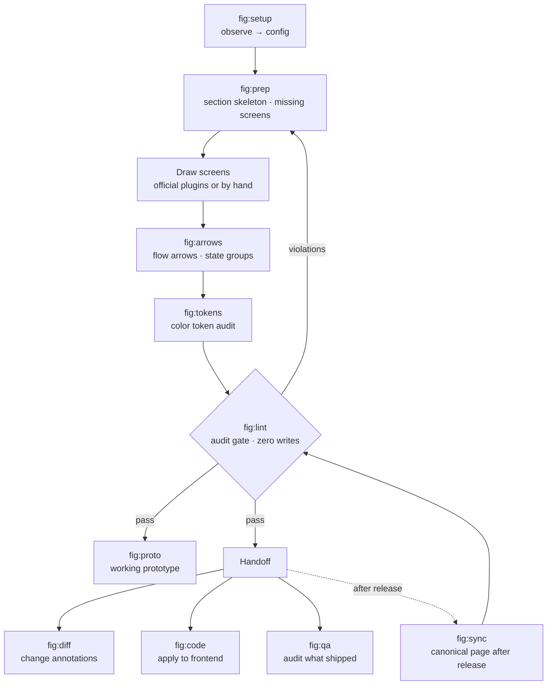

# fig · pm

[한국어](README.ko.md) · **English**

Most Claude Code plugins are aimed at the codebase. These two are aimed at the work beside it — the Figma file you draw in, and the spec you write next to it. One repository, installed separately.

| Plugin | What it does |
|---|---|
| **fig** | Everything around drawing a screen — the to-draw list before, the audit and sync after |
| **pm** | Write and verify product specs, then draft, file and reconcile the tasks |

**You do not write any code to use these.** You type `/fig:lint` the way you already type anything else to Claude, and it answers in words. A command to run or a settings file to edit turns up here and there — hand either to Claude rather than typing it yourself, and it does it and tells you what it found.

<sub>**New to Claude Code?** It is Anthropic's assistant, and it runs in a terminal, a desktop app, or your editor. Install it from [claude.com/claude-code](https://claude.com/claude-code) first — a *plugin* like these two adds commands to it, and a *marketplace* is where it downloads them from.</sub>

Neither needs the other. Most of what follows is about `fig`; `pm` has [its own section](#pm--product-docs), and the two settings you match up when you run both are in [Where the two meet](#where-the-two-meet).

[What it solves](#what-it-solves) · [Who it's for](#who-its-for) · [Getting started](#getting-started) · [**fig**](#fig--the-design-file) · [**pm**](#pm--product-docs) · [Where the two meet](#where-the-two-meet) · [Configuration](#configuration) · [Troubleshooting](#troubleshooting) · [Where it fits](#where-it-fits) · [Design principles](#design-principles)

<details>
<summary>If any of the words below are new — ten of them, one line each</summary>

| Word | What it means here |
|---|---|
| **Claude Code** | Anthropic's assistant, running in a terminal, a desktop app or your editor. Everything here happens inside it |
| **plugin** | A bundle of commands you add to Claude Code. `fig` and `pm` are two of them |
| **marketplace** | Where Claude Code downloads plugins from. `byjunyoung` is this repository's |
| **skill / slash command** | One command, typed as `/fig:lint`. A skill is the instructions Claude follows when you type it |
| **settings file** | One text file holding your team's rules — how screens are named, how far apart they sit. `/fig:setup` writes your first one |
| **`null`** | A setting deliberately left empty. The check that needed it is skipped rather than guessed at |
| **token** | A key you generate in a tool's own settings so a skill can talk to it directly. Figma and GitHub each have one |
| **connection** | A tool linked to Claude — Notion, Slack, GitHub. A skill can only reach what is connected |
| **tracker** | Wherever engineering keeps its tickets — GitHub, Jira, Linear. `pm` files into it |
| **canonical page** | The Figma page that is the current truth, as opposed to the working copies beside it |

</details>

## What it solves

**In the design file.** It rarely breaks when one person owns it. It breaks when there are several people, hundreds of screens, and a few months of history. Four things recur.

- **Duplication residue** — duplicate a screen to make a new one and the original's settings come along. An unused display toggle stays on, rendering an empty slot with nothing in it. It's invisible at zoomed-out scale
- **Stale canonical page** — engineering has already shipped, but the canonical Figma page still shows the old screen. The next person plans against it
- **Broken arrows** — move a screen and its flow arrows don't follow. Redrawing by hand costs enough that people leave them
- **The screen nobody drew** — "what shows up in this case?" You find out that screen doesn't exist when engineering asks

None of the four is catchable by eye, and by the time you do catch one, engineering has already asked. `fig` measures for them instead.

**In the document beside it.** Two more, and they cost the same day twice.

- **The request nobody sorted** — it arrived across a thread, a call and a hallway. Nothing separates what was decided from what somebody assumed, so the spec starts on sand and the same questions come back a week later
- **Ambiguity that survives review** — the unit a decision is made in, what a filter acts on, how a "primary" item is chosen, what a state transition means. A spec reads fine with any of those blank, and each one returns as a question halfway through the build

`pm` writes the first into a context table where fact, assumption and undecided are labelled apart, and refuses to publish a spec that left the second unanswered.

---

## Who it's for

Designers, and whoever writes the spec next to them.

Teams where one file is edited by several people over a long time. It doesn't matter whether you're drawing new screens or revising old ones.

- Teams sharing a file that has grown to hundreds of screens
- Anyone who repeats the cycle of drawing a feature's screens and handing them to engineering
- Anyone who has to keep handed-off designs and the canonical Figma page in step
- Teams that have file conventions but no way to check whether they're followed

Here's where it attaches when you're drawing something new. The official plugins draw what's inside a screen; this bundle handles what comes before and after.

```
Before   Lay out the section skeleton, stub missing states as dashed placeholders — that stub list is your to-draw list
During   Catch settings that tagged along when you duplicated a screen to make a variant
After    Wire up transition arrows and state groups, then pass the audit before handing off
```

Where it isn't the right tool:

- A one-off job of a screen or two is faster by hand
- Building a component library from scratch belongs to the official `figma-generate-library`

---

## Getting started

The short version first, then what it needs, then each step in full.

### Your first five minutes

Follow whichever one you installed. With both, start at the top — the two settings you then match up are in [Where the two meet](#where-the-two-meet).

**fig — the file you draw in**

```
1  Install                     two lines in a terminal, once per machine
2  /fig:setup <Figma file URL>  it reads how your file already names and spaces things,
                               and writes what it found into a settings file on your machine
3  /fig:lint                    the audit. It reads the page and reports back
4  Read the report              and decide what is worth fixing
```

**pm — the doc, and the tasks out of it**

```
1  Install                     two lines in a terminal
2  /pm:setup                    it reads how your own tools are set up and drafts your
                               settings. "No tools yet" is an answer it takes
3  Paste one request            at the end of setup — a thread, an email, anything —
                               and it sorts that into a context table: fact, assumed, undecided
4  Read the table               the rows left empty are the interview you still owe someone
```

**Neither writes into anything of yours.** `fig` writes nothing to Figma at all; `pm` writes to your doc tool or tracker only after a preview and an explicit go. All step 2 writes, either way, is one settings file on your own machine.

**With `fig` you find out at step 3 whether this is for you; with `pm`, at step 4.** The `fig` report names specific screens: this one sits outside its section, this arrow points at empty space, this duplicate kept a setting nobody wanted. If almost everything comes back flagged, that is not your file being a mess — it is the rules from step 2 being wrong, and [Troubleshooting](#troubleshooting) says which one to loosen. The `pm` table is the other way round: the empty cells are the result — each one is something nobody has decided, and together they tell you whether there is enough here to write a spec against.

**You never have to open the settings file yourself.** Tell Claude what to change in your own words — "stop checking screen names", "the gap between screens is 160, not 120" — and it edits the file for you.

The rest of this section has each step in full. From there, [**fig**](#fig--the-design-file) is the loop that runs around drawing one feature, and [**pm**](#pm--product-docs) takes a request through to a filed ticket.

### Prerequisites

| What | Why |
|---|---|
| **Claude Code** | These are Claude Code plugins |
| **The Figma MCP plugin** (`plugin:figma`) | Every `fig` skill reads and writes Figma through it. Confirm it answers before going further |
| **A Figma file** | `/fig:setup` infers conventions by measuring a file you already work in. An empty one, or a first one, takes the starter path instead — four rules proposed in plain words, then the first skeleton laid on a page |
| **`python3` with PyYAML, and `node`** | Config resolution runs on the host, and the audit scripts are syntax-checked with `node --check` |
| **A Figma personal access token** *(optional)* | A key you generate in Figma yourself (Settings → Security), which lets a skill ask Figma directly instead of going through the app. `/fig:read` enumerates every page over the REST API with one; without it, it falls back to the MCP and may see only some pages. `/fig:handoff` reads a saved version back through the same API where `handoff.version` is on — with no token it asks for the version's link to be pasted instead, and never hands over unpinned |
| **The `gh` command** *(pm, where the tracker is GitHub)* | GitHub's own command-line tool, installed on your machine and logged in separately from Claude. The GitHub side runs on it, not on Claude's connection. Log in with the account that can see the tracker — a personal account looking at a company repository sees nothing — and give it board access once with `gh auth refresh -s read:project` |

`pm` needs none of the Figma side. If you only write specs, install it alone.

**You don't have to check any of this by hand.** Step 2 tests every row of this table on
your own machine and names whatever is missing.

### What each skill needs

Everything under `fig` runs on `plugin:figma`. These skills want something more.

| Skill | Also needs |
|---|---|
| `/fig:proto` `/fig:code` `/fig:qa` | **Claude in Chrome** — they drive a real browser |
| `/fig:prep` `/fig:lint` `/fig:sync` `/fig:diff` `/fig:qa` | **Notion** — only where a config key points at a Notion page |
| `/fig:diff` `/pm:setup` `/pm:task-draft` `/pm:task-publish` `/pm:task-sync` | **GitHub** — only where `task_tracker.type` / `task.mirror.type` is `github`. Two logins are involved: Claude's connection, and the `gh` command the tracker is read through. The check covers both, and names the account `gh` is on |
| `/fig:qa` `/pm:task-draft` | **A chat tool** — only where the request source is a thread. For `pm`, `sources.chat_type` names it; `/fig:qa` takes the tool from the link. Slack ships |
| `/pm:log` | **A calendar and a chat tool** — both optional, named by `sources.calendar_type` and `sources.chat_type`; Google Calendar and Slack ship. Named as `none` they are skipped and the log says so. A scheduler on your own machine, if you want it unattended |
| `/pm:prd` | **Notion** — only where `prd.target` is `notion` |

The connection rows are conditional: point the config at `none` or at markdown and the skill still runs, it just writes somewhere else. The Chrome rows are not — those three open a browser.

Notion, GitHub, markdown, Slack and Google Calendar come with support built in; the rows read the same for any other tool your settings name.

**Once a config names a tool, it stops being optional.** The same check reads the config: a tracker set to `github` makes GitHub required, `prd.target: notion` makes Notion required, and a later run that cannot reach one stops on its name instead of coming back thin. On a machine with no config yet nothing beyond the host can be required — the summary says so, and `/pm:setup` re-runs the check with the answers it has just been given.

**A skill cannot call a tool it was never given.** If a connection is missing, the skill does not fail loudly; it simply cannot reach it. That is the most common reason a first run looks like it did nothing.

**The built-in support is for the claude.ai connections** — Notion, Slack and GitHub as claude.ai connects them. A tool this plugin has never seen — Linear, Jira, Confluence, Teams, a Notion behind your own server — is not a dead end: name it in your settings and `/pm:setup` writes the support for it from the tools actually connected on your machine, into `pm-adapters/` next to your settings, marking what it could not verify. What that support has to cover is written down in [`trackers/README.md`](plugins/pm/_common/trackers/README.md) and [`sources/README.md`](plugins/pm/_common/sources/README.md) — for whoever wants to read or edit one.

### 1. Install

```bash
claude plugin marketplace add byjunyoung/claude-product-skills
claude plugin install fig@byjunyoung
claude plugin install pm@byjunyoung      # only if you write specs
```

`claude plugin list` should now show `fig@byjunyoung`. Updating later takes both halves — the catalogue, then the copy you have installed, which stays pinned to its version until you say so:

```bash
claude plugin marketplace update byjunyoung
claude plugin update fig        # and pm, if it is installed. restart to apply
```

### 2. Point it at your work

Which entry point you take depends on what you installed. Each one **begins by checking this
machine** — `python3` and PyYAML, `node`, and which connections actually answer — and stops
there if something required is absent, rather than running on and coming back thin.

| You installed | Run | What it reads |
|---|---|---|
| `fig` | `/fig:setup <your figma file URL>` | how your file already names frames, spaces sections and draws arrows |
| `pm` | `/pm:setup` | your doc tool's and your tracker's schemas |
| `fig`, and you will use `/fig:deck` | `/fig:deck-setup` | your team's slide template |

**What the first run is like.** Each setup opens by saying what it will produce and how long it
takes, shows its steps, and names each one as it begins — read-only until the one file it
writes, which you see first. Questions come in your words, with options and a recommendation,
and "leave it blank" is always one of them: a blank is `null`, written with the question beside
it for whoever can answer. It ends on a first result rather than a file — `pm` drafts a context
table from one message you paste, `fig` audits one page — and names the commands to run next.

**fig.** Nothing is written to Figma — this step only reads. It counts how the file already
names frames, spaces sections, and styles arrows, takes the dominant value as the convention,
and **leaves anything it can't settle as `null` rather than guessing.** A thin sample or a split
vote produces a `null`, and it asks you about those rather than filling them in.

With nothing to observe — a first file, a team with no conventions yet — it proposes a starter
set instead: four rules in plain words, three questions, a config that says on every line that
it was chosen rather than measured, and then the first section and placeholders laid on a page
with `/fig:prep`, so the rules are visible on the canvas before anything is drawn.

The draft lands in `~/.claude/figma-conventions.yaml`, which survives uninstalling and
reinstalling the plugin. Pass `out: ./figma-conventions.yaml` instead for a project-local one.

Read the line comments before you accept it. They carry the evidence — `24/69 (35%)` means the
value turned up in 24 of 69 observations, which is why that one came back `null`.

**pm.** Reads the schemas of your doc tool and your tracker, and asks only what no schema
answers. Property names, select options, labels, board field ids and user mappings are read
from the live schema rather than guessed at. The draft lands in `~/.claude/pm-conventions.yaml`.

Where the doc tool and the tracker are reachable from different machines — the doc tool from
home, the tracker only on the office account — run it with `side: record` on one and
`side: mirror` on the other; each writes only its half of the same file. **Anything you cannot
answer is `null`**, and the file keeps the question beside it as a comment for whoever can.

Starting with nothing at all — no doc tool, no tracker — is an answer it takes: it lays out one
markdown repository (specs, tasks, logs) that needs no other tool, and a tracker attaches later
with `side: mirror`. And a tool it has never seen — Linear, Jira, Teams — is not a dead end:
name it in your settings and it writes the support from what is connected.

**deck.** `/fig:deck-setup` measures your team's slide template into `~/.claude/deck-assets`.
The plugin ships no template values at all, because deck backgrounds carry company wordmarks
and can't be distributed. Run it once before `/fig:deck`, and again when the template is revised.

### 3. Judge the first audit (fig)

`/fig:setup` finishes by running `/fig:lint` for you. **Read the result by its false-positive rate, not its violation count.**

If nearly every frame is flagged, the config is wrong and the file is fine — go loosen whichever pattern is doing the flagging, or set it to `null` to switch that check off. A handful of violations that you recognise as real means it's calibrated.

That's setup done. [**fig**](#fig--the-design-file) covers the loop from here.

---

## fig — the design file

`fig` is the half of Figma work that isn't drawing the screen itself. Three rhythms: the cycle of drawing and handing off one feature, the per-release pass that keeps the canonical page current, and a health check you can run any time.

### The cycle — drawing one feature through handoff

```
/fig:setup    First time in a file, observe its conventions and draft a config
/fig:prep     Lay out the section skeleton, stub missing states as placeholders
   ·          Draw the screens (official plugins, or by hand)
/fig:arrows   Wire transition arrows and state groups
/fig:lint     Audit structure, flow, and components in one pass
/fig:handoff  Gate the passing sections and hand over the links
/fig:diff     For revisions to existing screens, pin change annotations
```

`prep` comes first because it builds the to-draw list. A list screen needs an empty state; a form needs a validation-failure state. Stub those as dashed placeholders and the gaps become visible. The point is that they surface before engineering asks.


`lint` is the gate you have to pass. It never writes to the file, so running it repeatedly is safe.

### Per release — bringing the canonical page current

```
/fig:sync     Full audit of what made it into canonical → apply → archive
```

Working copies and the canonical page use identical screen names, so comparing names tells you nothing about what's missing. The audit judges on three signals together: the text inside a screen, the screen's height, and its component links.

When the structure matches, it edits values rather than replacing the whole screen. Node ids survive, so deep links from specs and tickets keep working.

### Any time — a file health check

```
/fig:lint     Structure, flow, and component audit (zero writes)
/fig:tokens   Check that colors are bound to design system tokens
```

Neither touches the file. Run one when you inherit a file someone else has been in, or when you reopen something old, and you'll know where it stands.

### Two side branches

```
/fig:proto    Before engineering starts, rebuild the design as a single HTML page that really accepts input and saves
/fig:code     Apply the design to a frontend repo
/fig:qa       Audit a shipped screen against the spec and report defects
/fig:deck     Turn a document into a deck (run deck-setup first)
```

`proto` isn't a click-through demo. Enter a value, save it, and it shows up in the list. Clicking through surfaces ordering problems that a static design hides.

`deck` moves one source document into a presentation flow and builds a Figma Slides deck. It uses the team template's coordinates, colors and type as-is — when a content shape isn't in the catalog it never invents a layout, it fits the nearest archetype by trimming content or splitting the slide. `/fig:deck-setup` measures those values into local assets, which stay out of the published plugin since template backgrounds carry company wordmarks.

`qa` audits what actually shipped against the spec. The rule is that a finding reads "this breaks rule X in document Y", never "this looks off" — anything without a baseline is filed as needs-checking rather than a defect.


`code` separates what the design owns (numbers, colors, copy, states) from what the code owns (file structure, naming, state management), so neither overwrites the other.

### What it looks like


### The whole flow



### The skills

| Command | What it does |
|---|---|
| `/fig:setup` | Observe a file's conventions and draft a config |
| `/fig:read` | Collect the page and screen inventory |
| `/fig:prep` | Normalize names · place into sections · stub missing screens |
| `/fig:arrows` | Create and re-sync flow arrows |
| `/fig:lint` | Read-only audit gate (zero writes) |
| `/fig:handoff` | Pick from the lint-passed sections · pin the version · hand over the links · one line in the task doc |
| `/fig:tokens` | Audit design system token binding for colors |
| `/fig:sync` | Full canonical-page audit → apply → archive |
| `/fig:diff` | Annotate changes · write up the task doc |
| `/fig:proto` | Working single-file HTML prototype |
| `/fig:code` | Apply the design to a frontend repo |
| `/fig:qa` | Audit a shipped screen against the spec and report defects |
| `/fig:deck-setup` | Measure a team slide template into local deck assets |
| `/fig:deck` | Turn a source document into a Figma Slides deck |

### What `/fig:lint` looks at

| Area | What it catches |
|---|---|
| Structure | Screens outside any section · screens past section bounds · overlapping screens · naming violations · section number vs. placement mismatch |
| Flow | Arrows cutting through unrelated screens · arrowheads pointing at empty space · screens on no flow at all · labels covering an arrowhead or another line |
| Components | Variants stacked on top of one another inside a set · a component buried under the one placed beside it · settings that tagged along in a duplicate, leaving an empty slot rendered |


Arrowhead direction isn't catchable by distance alone. An arrow can sit 12px away and still point into empty space if its last segment runs parallel to the target edge. So the audit checks perpendicularity separately.

The component audit works without any written convention. It derives the usage distribution from how other screens in the same file use that component, and compares against it.

The two overlap checks read coordinates alone, so they run on a file with no config at all — and they run on a component page, which the frame-overlap check above never looked at. A set with no auto-layout drops each new variant on the last one's coordinates: the top variant draws fine and the rest are simply not visible, which is why review keeps letting it through.

---

## pm — product docs

A separate plugin covering the document and the work that comes out of it.

| | |
|---|---|
| `/pm:setup` | Read your tool schemas and draft the config, ids included |
| `/pm:prd` | Write a requirements doc against a format, in language its readers can act on |
| `/pm:task-draft` | Turn a request thread into a task's context table |
| `/pm:task-publish` | File that task as a ticket in the engineering tracker |
| `/pm:task-sync` | Reconcile the planning list against that tracker |
| `/pm:log` | Record a day's work as a file, unattended, from the same tracker |
| `/pm:log-review` | Turn a period of those files into accomplishment statements |

### The cycle — a request through to a filed ticket

```
/pm:setup          First time in a workspace, read the schemas and draft a config
/pm:task-draft     Sort a request thread into the task's context rows
/pm:prd            Write the entries the work will be built and judged against
/pm:task-publish   File it as a ticket, once the scope has settled
/pm:task-sync      Every so often, reconcile the whole list against the tracker
```

`task-draft` comes before `prd` because the context table is what tells you whether there is enough here to write a spec at all. The rows that stay empty are the interview you still owe someone.


`task-publish` takes one task and `task-sync` takes the list, because the two fail differently. One task fails by being filed wrong. A list fails by drifting — unfiled, duplicated, wrong parent, resurrected, naming a release the tracker has since moved it out of, or still saying a task is a quarter done when every box on it has been ticked. Diagnosing drift means reading both sides first, which is why `sync` shows you the diagnosis and waits rather than writing.

Where your task list carries how far along something is and when it started, those move with the tick that changed them: `publish` writes them in the same approval as the edit, and `sync` counts them from the checklist rather than estimating. A progress figure nobody moved is the kind of drift that surfaces in a status meeting instead of in a diff, so neither skill invents one — with those properties unnamed in the config, the check is simply off.

The release a task is tied to moves the same way, in one direction only. The tracker's milestone is the answer; a version column on your list, named in `task.properties.version`, is a copy both skills keep current rather than a second place to decide it.

**A ticket carries what counts as done.** Two sections decide it — the done conditions and the QA checklist — and they start life in the ticket rather than as a copy of the record: the record answers why the work is happening, the ticket answers what finishes it, and the boxes are ticked where engineering works. `/pm:task-publish` drafts both from the spec entry and the design before it asks anything, and it drafts them as a coverage pass — every row of the behaviour table, every state and case, every rule and exception either produces a condition or is named in the preview as skipped, so a thin draft is visible instead of silent. `task.contract.level` says which ticket carries them, the task or the parent it hangs under; put them where review happens, because a condition and the step confirming it, split across two tickets, cannot be checked against each other. A ticket filed before its requirement exists says so in that section rather than looking finished.

**The task side assumes nothing about your tracker.** A team that plans and builds in one place sets `task.mirror.type: none`, and `/pm:task-sync` says there is nothing to reconcile — which is the right answer, not an error. A team that plans in one tool and builds in another names both, and matching runs on one property holding the ticket's url. A back-link in the ticket body is never trusted for matching: it can point at a source that was already discarded, and that is how duplicates and resurrected tickets happen.

**Your tracker's own conventions outrank this config, so they are read rather than copied.** Where `task.policy.doc` names the rules a tracker is run by, and `task.template` names the ticket skeleton everyone else files on, both are read at run time and both win. A ticket then comes out shaped like its neighbours — the template's headings, in the template's order, carrying the labels the rules require — rather than shaped like whatever the config last remembered. Copying either one into config is how a config goes quietly stale: a section gets renamed, a rule changes at a meeting the file was not in, and nothing tells the file. Where a configured section name is no longer in the template, the run names both and stops, instead of writing a second section beside the first — two sections holding the same thing is the failure nobody spots. Tickets already filed are not rewritten behind your back — the contract writer leaves every section it does not own byte for byte — but they are not stranded either. `/pm:task-publish` offers to bring one back to the template, moving whole blocks rather than re-drafting them and asking where every orphaned piece of content should go, under its own preview and its own "go". `/pm:task-sync` surveys the rest and reports; the same edit across a whole list, on one approval, is the one thing neither skill will do.

**It doesn't care where the doc lives.** The structure is the same everywhere; `prd.target` only changes how it's published.

```
markdown   local files. the default — no other tooling required
git        writes markdown, then branch and PR
notion     Notion pages. requires the prd.notion section
```

Four things it holds to.

**No leftover vagueness.** The unit a decision is made in, what a filter or sort acts on, how a "primary" item is chosen, what a state transition means — a feature doesn't hold together without these, so they get concrete values. If any field could have been settled from the material and was left as TBD, verification fails.

**A product doc is not an engineering doc.** Anything in `forbidden_terms` appearing in the body is rejected. It writes *what* is required and leaves *how* to engineering or to a TBD.

**It writes for whoever reads the spec, not for whoever builds the thing.** That term list reads names, and a sentence carrying none of them can still describe a machine — *the view switches depending on whether an active job exists* passes every string check there is and tells a designer nothing. So the sentences get read separately, against one question: does this say what a person sees, or what the system decided? A number arrives with its meaning beside it, a table cell says what happens instead of naming it, and a word the reader may not have is explained where it first appears. None of which is allowed to change the document — values, decisions and structure stay exactly where they were, and only the wording moves.

**It stops before writing.** Verification is read-only, publishing happens only after a preview and an explicit go, and even then in stages — skeleton, then user groups, then feature entries.

### The log side — what you actually did

Two of the skills are not about the spec. They keep a record of your own work, read from the same tracker.

```
every workday   /pm:log          one file a day — facts, quotes, evidence. unattended
now and then    /pm:log-review   a period of those files → accomplishment statements
```

They are split on purpose. The daily run records only what happened and never rates it; the review asks you the three things a file cannot know — your role, what the result can be measured by, what you learned. An unattended agent writing daily about the significance of its own work fills a log with claims nobody can check later.

The first run already pays: a day's file is a written end-of-day summary. That it accumulates into review material is the second benefit, not the first one you feel. `pm/README.md` carries the wrapper script, the scheduling note, and the importer for an existing Notion log.

Configuration lives in `pm-conventions.yaml`, layered the same way as `fig`.

---

## Sharing one config across a team

Both plugins read a config file, and a team running these skills against one tracker shares
one. That means a copy on every machine — and a copy has no way of knowing its own age. Every
run on an old one succeeds, so the first sign that somebody was working from a stale copy is
what it wrote into the tracker.

Nothing is asked of the file. A stamp naming the version it was written for would be a claim
about the past that nobody updates, and whoever read the warning could silence it by editing
the stamp. So the plugins look at where the file came from instead:

```
python3 <plugin>/_common/scripts/lib/resolve-config.py --name pm-conventions.yaml --origin
```

**Keep the config in a repository and symlink it into `~/.claude`.** Nothing in the file
changes. A `SessionStart` hook then says when your copy has fallen behind, and says nothing
when it has not:

| `CLAUDE_SHARED_CONFIG` | What happens at the start of a session |
|---|---|
| unset, or `fetch` | looks, reports if you are behind, changes no file — the default |
| `pull` | fast-forwards the work tree too, and skips it if you have uncommitted work |
| `off` | nothing |

Any other way of sharing still works — a drive, a pasted block. The skills simply have less to
say about it: how old the file is, but not how far behind. `/pm:setup` and `/fig:setup` ask
once whether anybody else runs these skills, and wire this up where the answer is yes.

There is a second half to the same problem. A key your config never mentions still resolves —
to the plugin's own defaults — so it is not missing, it is somebody else's. Where that value
decides what gets written into a shared tool, the skill stops rather than write a shape your
team never chose:

```
task.contract.level is not set in pm-conventions.yaml — the value in play came from the
plugin's own defaults, which nobody on your team chose. …
```

---

## Where the two meet

The two plugins never call each other. What they share is two objects, each named twice — once in `figma-conventions.yaml` and once in `pm-conventions.yaml`. **Install both and you point each pair at the same place.**

| The object | `fig` calls it | `pm` calls it |
|---|---|---|
| The requirements doc | `qa.baseline.prd` | `prd.target`, and the `prd.notion` block |
| The task record | `task_tracker.ref` | `task.record.ref` |

Those two are the whole of the configuration, and each half of it exists for a reason. `/fig:qa` needs the spec because a defect report is only worth handing over when it reads *this breaks rule X in document Y* — and `/pm:prd` is what wrote document Y. `/fig:diff` needs the task record because an AS-IS/TO-BE table belongs beside the request that caused it — and `/pm:task-draft` is what opened that record.

Neither link is required. Leave `qa.baseline.prd` **empty** — written as `null`, which is how these settings say *not set*, and the check that needs it is skipped rather than failed — `/fig:qa` then files everything as needs-checking rather than as a defect. Leave `task_tracker.type` at `none` and `/fig:diff` prints its table as markdown instead. You lose the linkage, not the skill.

**One more thing crosses, and it travels as data rather than as config.** Where `handoff.version` is on, `/fig:handoff` pins the moment it hands over — a Figma named version — and writes its label and date into the task doc. `/pm:task-publish` reads that line to fill the ticket's referenced-version row, and where `contract.design_match_line` is set, the done condition reads *the build matches the {version} design*. Without the pin that condition points at a target that moves the next time somebody opens the file.

Drawn out, one feature goes round like this.


And the next request starts it again, against a canonical page that is now current.

---

## Configuration

Conventions live in one file, `figma-conventions.yaml`, not in the skill docs. Screen naming, the state list, spacing values, section style, arrow style, sections excluded from audit, and tolerances are all there.


The full schema lives in [`conventions.example.yaml`](plugins/fig/_common/conventions.example.yaml) — every section commented with what it governs, so you can copy it and edit in place. It looks like this:

```yaml
naming:
  frame: "{screen}-{state}"           # human-readable form
  frame_pattern: '^.+-[^-\s]+$'       # lint uses this as a regex directly
  states: [Default, Empty, Loading, Error, Validation, Selected]
  required_states:
    list: [Default, Empty, Loading, Error]

pages:
  strict:   ['^\[UI\] ']              # full rules apply
  exclude_sections: ['^Template$']    # exempt from audit

layout:
  column_grid: 1560
  frame_gap: 120

arrows:
  color: "#4A5463"
  audit: { edge_tolerance: 2, gap_range: [9, 15] }
```

- **First run** — `/fig:setup` in the target file observes its conventions and drafts one
- **Partial configs are fine** — the three layers are merged, so keys you omit fall back to defaults and only what you write is overridden
- **What `null` means** — the value wasn't inferred, so that check is skipped. To disable a check, write `null` rather than deleting the key — deleting it brings the default back
- **Settings a skill cannot run without** — it checks them first, and stops naming the one that is blank instead of running on nothing. That is a gap in the settings, not a problem with your tool; `/pm:setup` fills it in
- **Tools** — how to work with one tool lives in one file, and the tool's name in your settings picks it. Ones you add live in `pm-adapters/` next to your settings, so a plugin update never overwrites them. A tool with no file stops the skill, and `/pm:setup` writes the file from what is connected on your machine
- **Per-file settings** — things that differ by file, like which pages are canonical vs. archive, go under `files.<fileKey>`

Once you have a draft, run `/fig:lint` once and judge it by the false-positive rate. If nearly everything is flagged, the config is wrong, not the file.

---

## Troubleshooting

Each line is a symptom — open it for what it means and what to do. Where an entry names a command, you can paste it to Claude instead of running it yourself.

<details>
<summary><b>The report says it ran on defaults.</b></summary>

Your settings file was not found, so the built-in defaults ran instead. From your project folder, run `python3 plugins/fig/_common/scripts/lib/resolve-config.py --where` — it prints the files it actually found. Usually the filename has a typo, or the file is somewhere other than `~/.claude/`.

</details>

<details>
<summary><b>Everything in the file comes back as a violation.</b></summary>

The rule is wrong, not the file. A naming pattern that only accepts Latin letters flags every Korean name, for example. Loosen the pattern in the settings, or set it to `null` to switch that one check off.

</details>

<details>
<summary><b>I changed a skill and nothing changed.</b></summary>

Claude Code keeps the installed copy pinned to a version, so editing the source does nothing until the version number goes up. Raise it in `plugin.json`, then `claude plugin marketplace update`, then uninstall and reinstall the plugin.

</details>

<details>
<summary><b>`check.sh` says `Permission denied`.</b></summary>

The file arrived without permission to run on its own. Call it as `bash <path>` instead.

</details>

<details>
<summary><b>A Figma token request comes back 401.</b></summary>

Figma rejected the token — it exists, but it is expired or wrong. `/fig:read` checks that the token is set before calling, so a 401 is never "no token". Issue a new one in Figma's Security tab.

</details>

<details>
<summary><b>`/fig:read` only returns some of the pages.</b></summary>

Without a token it can only see what the desktop app has open. To list every page it needs a token — see the prerequisites.

</details>

<details>
<summary><b>`/fig:deck` says there are no assets.</b></summary>

The slide template has not been measured yet. Run `/fig:deck-setup` once — it reads your team's template into `~/.claude/deck-assets`. The plugin ships no template, because template backgrounds carry company wordmarks.

</details>

<details>
<summary><b>A deck came out in the wrong font.</b></summary>

Your team's font is not installed on this machine, so the next candidate was used and the line breaks moved. Install the font, or keep the substitute and check where the lines break.

</details>

<details>
<summary><b>Reports come out in the wrong language.</b></summary>

`meta.language` in the settings decides it. `auto` follows the language you are talking in; `ko` or `en` pins it.

</details>

<details>
<summary><b>The check passed, but the tracker step came back empty.</b></summary>

GitHub is two logins, and only one of them was checked. Claude's GitHub connection is one; the `gh` command on your machine is the other, with its own account — and the tracker is read through `gh`. A personal account looking at a company repository sees nothing, which reads as if the repository did not exist. Run `gh auth status` to see which account is active, and `gh auth switch` to change it. To read project boards, the login also needs one extra permission: `gh auth refresh -s read:project`. The check now prints the account it found and tries to open the tracker with it.

</details>

<details>
<summary><b>The GitHub connection says "connected, but not responding".</b></summary>

Claude's GitHub connection is set up, but the login token it sends is empty — usually because Claude Code was opened from somewhere that never loaded the token, such as the desktop app. Open Claude Code from the terminal where the token is set, and it comes back. This is a different fix from "not connected".

</details>

<details>
<summary><b>A `fig` skill stops before writing and mentions your seat.</b></summary>

Your Figma account can view that file but not edit it, and the skill checked before touching anything. Reading works; every write needs an Edit seat on the file's plan, and retrying will not change that. Either the file moves to a plan where you have one, or someone with a seat runs the write.

</details>

<details>
<summary><b>A skill stops saying a setting "is not set".</b></summary>

That value is empty in every settings file, and the skill cannot run without it. `/pm:setup` fills it in — or open the file and write it. An empty list is a value and does not stop a skill; only a missing one does.

</details>

<details>
<summary><b>A skill stops saying a tool "is not supported yet".</b></summary>

Your settings name a tool nobody has described how to work with. `/pm:setup` writes that support from the tools actually connected on your machine, into `pm-adapters/` next to your settings — and marks what it could not verify. Until then the skill stops rather than guessing how the tool works; a guess is how a ticket lands in the wrong place.

</details>

<details>
<summary><b>A skill stops saying a tool is "supported as the other side".</b></summary>

A tool can be where tasks are planned, or where engineering tracks them, and the support that ships covers one side each — GitHub as the tracking side, Notion and markdown as the planning side. Your settings put one on the other side. `/pm:setup` can add that side from what is connected.

</details>

<details>
<summary><b>A skill wrote something you didn't expect.</b></summary>

Every write to Figma, a spec page or a branch goes through a preview and an explicit go. If one happened without that, it's a bug worth [reporting](https://github.com/byjunyoung/claude-product-skills/issues).

</details>

---

## Where it fits

Figma tooling splits into two halves: the half that draws what's inside a screen, and the half that handles everything around it.

Figma's official plugins (`figma-use`, `figma-generate-design`, `figma-generate-library`) are the first half. Give them code or a description and they produce screens and components.

This bundle is the second half. Before you draw, it lays out the section skeleton and stubs the states that are missing, so the gap list is what you draw next. After, it checks whether names follow the convention, whether screens sit where they belong, whether flow arrows actually connect, whether changes shipped to engineering made it back into the canonical page. It runs on top of the official plugins, so you use both.

Drawing is the official plugins' job. What happens around the drawing is this bundle's.

---

## Design principles

**One place decides.** The skills that write to files (`prep`, `arrows`, `sync`) contain no audit code. `/fig:lint` is the only thing that judges right from wrong; everything else just fixes what it flagged. Spread the checks across skills and you get a gap — "I skipped that skill this time, so the check never ran."

**Conventions are observed, not asked.** Every team names screens differently, spaces them differently, groups sections differently. `/fig:setup` doesn't ask — it reads the file and works it out. People get their own team's conventions wrong when answering from memory.

**When unsure, leave it empty.** If the observation is ambiguous, meaning too few samples or a near-even split, the value stays `null` instead of being filled in. `null` means that check is skipped. Not knowing a rule and breaking a rule are different things, and mixing them buries the report in false positives until nobody reads it.

---

## Layout

<details>
<summary>The repository tree</summary>

```
.claude-plugin/
  marketplace.json             marketplace entry (plugin list)
plugins/
  fig/
    .claude-plugin/plugin.json
    README.md
    skills/
      setup   read  prep   arrows  lint
      handoff sync  diff   tokens
      proto   code  qa     deck    deck-setup     one SKILL.md each
    _common/
      conventions.example.yaml           config schema + bundled defaults
      scripts/
        audit-struct.js                  membership, bounds, overlap, naming, ordering
        audit-flow.js                    arrow geometry, entry direction, pass-through, labels, coverage
        audit-component.js               component default residue
        arrow-build.js                   arrow construction helper
        prep-ops.js                      page cleanup helper
        probe-page.js                    convention observation
        lib/                             config resolution, preflight, draft generation, syntax check
  pm/
    .claude-plugin/plugin.json
    README.md
    skills/
      setup  prd  task-draft  task-publish
      task-sync  log  log-review          one SKILL.md each
    _common/
      conventions.example.yaml           config schema + bundled defaults
      trackers/                          one file per tracker — notion, github, markdown; the contract and a template
      sources/                           one file per chat or calendar — slack, google-calendar; contract and template
      scripts/lib/                       config resolution, preflight (copies of fig's, held identical), adapter lookup
tools/
  verify.py                    consistency check (repo tool, not shipped)
  test/                        fixtures — arrow geometry, config resolution
```

</details>

One repo holds several plugins. `plugins` in `marketplace.json` is an array, so they install separately while sharing one repo and one checker.

<details>
<summary>If you are editing the plugins themselves</summary>

Figma plugins have no filesystem access. So config resolution happens locally: `resolve-config.py --js <fileKey>` emits a single line that gets prepended to the script before it runs. Script paths are relative to `${CLAUDE_PLUGIN_ROOT}`, since install locations differ between environments.

After editing a skill, run `bash tools/verify-all.sh` from the repo root — the consistency check plus every fixture, the same list CI runs. The consistency check itself (`tools/verify.py`) covers every plugin listed in the marketplace, and flags shared files that have drifted apart between them. The same run happens on every push. The one check that needs your team's own names — the leak check — runs there too once a `TEAM_STRINGS` secret holds the list, one name per line, in the form `team-strings.example.txt` shows; the names are masked in the log.

</details>

---

## Built with

Claude Code skills (Markdown) + the Figma Plugin API (JavaScript) + config resolution and aggregation (Python). PyYAML is the only external dependency.

---

## Author

Junyoung Kim · [LinkedIn](https://www.linkedin.com/in/byjunyoung/)

---

## License

© 2026 Junyoung Kim · [LICENSE](LICENSE)

Installing and using it is free. Use it personally or inside your organization, and modify it if you need to.

Redistributing a fork, republishing it under another name, or reselling it commercially requires permission. That's why there's no standard open source license attached. Reach me through [Issues](https://github.com/byjunyoung/claude-product-skills/issues) or LinkedIn.

---

## Feedback

Bug reports and feature ideas go in [Issues](https://github.com/byjunyoung/claude-product-skills/issues).
